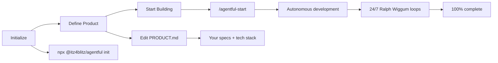

# agentful

**One-Command Autonomous Product Development Kit for Claude Code**


agentful is an opinionated starter template for Claude Code that transforms it into an autonomous development system with specialized agents, 24/7 development loops, dynamic tech stack detection, and quality gates.

Quick Start · Features · Agents · Documentation

---

## What is agentful?

agentful supercharges Claude Code with:

- **7 Specialized Agents** - Orchestrator, Architect, Backend, Frontend, Tester, Reviewer, Fixer
- **24/7 Development** - Works while you sleep with Ralph Wiggum loops
- **Dynamic Tech Stack Detection** - Automatically generates agents for YOUR stack
- **Quality Gates** - Type checking, Linting, Tests, Coverage, Security, Dead code detection
- **Progress Tracking** - See exactly what's done and what's next

---

## Quick Start

```bash
# 1. Initialize in your project
npx @itz4blitz/agentful init

# 2. Choose your product structure

You have two options:

**Quick Start** - Single file at root:
```bash
# Edit PRODUCT.md with your requirements
```

**Organized** - Use .claude/product/ directory:
```bash
# Edit .claude/product/index.md
# Or organize domains in .claude/product/domains/
```

Both work the same - agentful auto-detects your format. See [Product Structure](#product-structure) below.

# 3. Start Claude Code
claude

# 4. Begin autonomous development
/agentful-start
```

That's it! agentful will analyze your product spec, detect your tech stack, generate specialized agents, and start building autonomously.

---

## Product Structure

agentful supports two product organization formats with **automatic detection**:

### Option 1: Flat Structure (Quick Start)

Best for small projects and MVPs. Use a single `PRODUCT.md` file at your project root:

```bash
your-project/
├── PRODUCT.md          # All features in one file
├── src/
└── package.json
```

### Option 2: Hierarchical Structure (Organized)

Best for larger projects with 20+ features or team collaboration. Organize by domains:

```bash
your-project/
├── .claude/
│   └── product/
│       ├── index.md              # Product overview
│       └── domains/
│           ├── authentication/
│           │   ├── index.md      # Domain overview
│           │   └── features/
│           │       ├── login.md
│           │       └── register.md
│           └── user-management/
│               ├── index.md
│               └── features/
│                   └── profile.md
```

**The system auto-detects which format you're using** - no configuration needed. Start flat, migrate to hierarchical as your project grows.

Learn more in [Product Structure Guide](https://agentful.app/configuration/project-structure).

---

## How It Works



---

## Commands

| Command | Description |
|---------|-------------|
| `/agentful-start` | Begin or resume autonomous development |
| `/agentful-status` | Check current progress and what's being worked on |
| `/agentful-decide` | Answer pending decisions that block development |
| `/agentful-validate` | Run all quality checks |

---

## Agents

agentful includes specialized agents that work together:

| Agent | Purpose |
|-------|---------|
| `orchestrator` | The brain - coordinates work, never codes directly |
| `architect` | Analyzes tech stack, generates specialized agents dynamically |
| `backend` | Services, repositories, controllers, APIs |
| `frontend` | Components, pages, hooks, styling |
| `tester` | Unit, integration, E2E tests |
| `reviewer` | Code review, dead code detection, quality validation |
| `fixer` | Auto-fixes validation failures |

---

## 24/7 Development

For fully autonomous overnight development, use the Ralph Wiggum plugin:

```bash
/ralph-loop "/agentful-start" --max-iterations 50 --completion-promise "AGENTFUL_COMPLETE"
```

agentful will work while you sleep, only stopping when:
- All features are complete (100%)
- All quality gates pass
- Or max iterations reached

---

## Quality Gates

Code must pass ALL gates before completion:

- All tests passing
- No TypeScript errors
- No lint errors
- No dead code (unused exports, files, dependencies)
- Test coverage ≥ 80%
- No security issues

---

## Project Structure

After initialization, your project will have:

```
your-project/
├── PRODUCT.md              # Option 1: Single file at root
├── CLAUDE.md               # Project instructions for Claude
├── .claude/                # agentful configuration (version control)
│   ├── product/            # Option 2: Organized product structure
│   │   ├── index.md        # Product overview (or all features)
│   │   ├── domains/        # Optional: Domain organization
│   │   │   └── auth/       #     for large projects
│   │   │       ├── index.md
│   │   │       └── features/
│   │   ├── EXAMPLES.md     # Feature writing examples
│   │   └── README.md       # Structure guide
│   ├── agents/             # Specialized agents
│   ├── commands/           # Slash commands
│   ├── skills/             # Domain skills
│   └── settings.json       # Hooks and permissions
├── .agentful/              # Runtime state (gitignored)
│   ├── state.json          # Current work state
│   ├── completion.json     # Progress tracking
│   ├── decisions.json      # Pending/resolved decisions
│   └── architecture.json   # Detected tech stack
└── src/                    # Your code (generated by agentful)
```

---

## Documentation

Full documentation at [agentful.app](https://agentful.app)

### Key Topics

- [Installation](https://agentful.app/getting-started/installation)
- [Quick Start Guide](https://agentful.app/getting-started/quick-start)
- [Agents Overview](https://agentful.app/agents)
- [24/7 Autonomous Development](https://agentful.app/autonomous-development/24-7-development)
- [Quality Gates](https://agentful.app/autonomous-development/quality-gates)
- [Configuration](https://agentful.app/configuration)

---

## Requirements

- **Claude Code** - [Install here](https://code.anthropic.com)
- **Node.js 22+**

### Optional: 24/7 Autonomous Development

For fully autonomous overnight development, install the Ralph Wiggum plugin inside Claude Code:

```bash
# 1. Start Claude Code in your project
claude

# 2. Inside Claude Code, install the plugin
/plugin install ralph-wiggum@anthropics

# 3. Then run autonomous loops
/ralph-loop "/agentful-start" --max-iterations 50 --completion-promise "AGENTFUL_COMPLETE"
```

---

## License

MIT License - see [LICENSE](LICENSE) for details.
