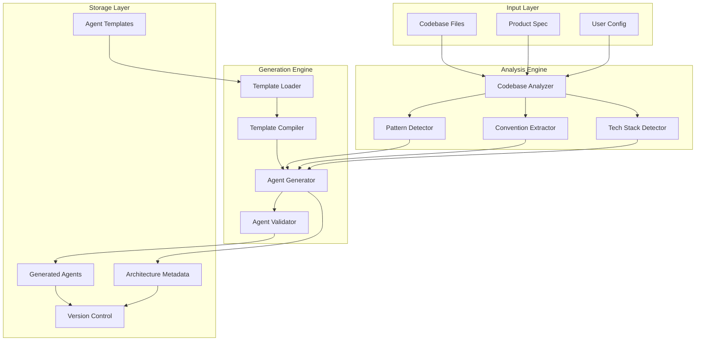

# Agent Generation System Architecture

## Overview

The Agent Generation System is the core of agentful's ability to create codebase-specific AI agents. It analyzes a project's structure, patterns, and conventions to generate specialized agents that understand and follow that specific codebase's standards.

## System Components



## 1. Codebase Analyzer

### Core Architecture

```typescript
interface CodebaseAnalyzer {
  analyze(projectPath: string): Promise<AnalysisResult>;
  detectProjectType(): ProjectType;
  sampleFiles(pattern: string, limit: number): File[];
  extractMetadata(): ProjectMetadata;
}

interface AnalysisResult {
  projectType: 'new' | 'existing';
  confidence: number; // 0.0 - 1.0
  techStack: TechStack;
  patterns: PatternMap;
  conventions: ConventionSet;
  structure: ProjectStructure;
  dependencies: DependencyGraph;
  errors?: AnalysisError[];
}
```

### Pattern Detection Engine

```typescript
class PatternDetector {
  private detectors: Map<string, IPatternDetector> = new Map([
    ['imports', new ImportPatternDetector()],
    ['exports', new ExportPatternDetector()],
    ['components', new ComponentPatternDetector()],
    ['api', new APIPatternDetector()],
    ['database', new DatabasePatternDetector()],
    ['testing', new TestPatternDetector()],
    ['styling', new StylePatternDetector()],
    ['state', new StateManagementDetector()],
    ['auth', new AuthPatternDetector()],
    ['error', new ErrorHandlingDetector()]
  ]);

  async detectPatterns(files: File[]): Promise<PatternMap> {
    const patterns = new Map<string, Pattern[]>();

    for (const [name, detector] of this.detectors) {
      const detected = await detector.detect(files);
      if (detected.confidence > 0.5) {
        patterns.set(name, detected.patterns);
      }
    }

    return patterns;
  }
}

interface IPatternDetector {
  detect(files: File[]): Promise<DetectionResult>;
  extractExamples(files: File[]): CodeExample[];
  getConfidence(): number;
}
```

### Convention Extraction

```typescript
class ConventionExtractor {
  extractNamingConventions(files: File[]): NamingConvention {
    return {
      files: this.detectFileNaming(files),
      variables: this.detectVariableNaming(files),
      functions: this.detectFunctionNaming(files),
      classes: this.detectClassNaming(files),
      components: this.detectComponentNaming(files),
      constants: this.detectConstantNaming(files)
    };
  }

  extractStructureConventions(root: string): StructureConvention {
    return {
      layout: this.detectProjectLayout(root),
      modules: this.detectModuleOrganization(root),
      tests: this.detectTestOrganization(root),
      assets: this.detectAssetOrganization(root),
      config: this.detectConfigLocation(root)
    };
  }

  extractCodeStyleConventions(files: File[]): CodeStyleConvention {
    return {
      indentation: this.detectIndentation(files),
      quotes: this.detectQuoteStyle(files),
      semicolons: this.detectSemicolonUsage(files),
      lineEndings: this.detectLineEndings(files),
      maxLineLength: this.detectMaxLineLength(files),
      bracketStyle: this.detectBracketStyle(files)
    };
  }
}
```

### Tech Stack Detection

```typescript
class TechStackDetector {
  private readonly stackIndicators = {
    // Frontend Frameworks
    'react': {
      files: ['package.json'],
      patterns: [/['"]react['"]/],
      imports: ['react', 'react-dom'],
      confidence: 0.9
    },
    'nextjs': {
      files: ['next.config.js', 'next.config.mjs', 'next.config.ts'],
      patterns: [/['"]next['"]/],
      directories: ['app/', 'pages/'],
      confidence: 0.95
    },
    'vue': {
      files: ['vue.config.js', 'package.json'],
      patterns: [/['"]vue['"]/],
      extensions: ['.vue'],
      confidence: 0.9
    },

    // Backend Frameworks
    'express': {
      patterns: [/express\(\)/g, /app\.(get|post|put|delete)/],
      imports: ['express'],
      confidence: 0.85
    },
    'fastapi': {
      imports: ['fastapi', 'uvicorn'],
      patterns: [/@app\.(get|post|put|delete)/],
      confidence: 0.9
    },
    'django': {
      files: ['manage.py', 'settings.py'],
      imports: ['django'],
      patterns: [/INSTALLED_APPS/],
      confidence: 0.95
    },

    // Languages
    'typescript': {
      files: ['tsconfig.json'],
      extensions: ['.ts', '.tsx'],
      confidence: 0.95
    },
    'python': {
      files: ['requirements.txt', 'pyproject.toml', 'setup.py'],
      extensions: ['.py'],
      confidence: 0.9
    },
    'go': {
      files: ['go.mod', 'go.sum'],
      extensions: ['.go'],
      confidence: 0.95
    }
  };

  async detect(projectPath: string): Promise<TechStack> {
    const detected: TechStackItem[] = [];

    for (const [tech, indicators] of Object.entries(this.stackIndicators)) {
      const score = await this.calculateConfidence(projectPath, indicators);
      if (score > 0.5) {
        detected.push({
          name: tech,
          version: await this.detectVersion(tech, projectPath),
          confidence: score,
          role: this.categorize(tech)
        });
      }
    }

    return this.buildTechStack(detected);
  }
}
```

## 2. Agent Template System

### Template Structure

```yaml
# Base template: .agentful/templates/base-agent.yaml
meta:
  version: "1.0"
  type: "base"

agent:
  name: "{{agent_name}}"
  description: "{{description}}"
  model: "{{model}}"
  tools: {{tools}}

sections:
  - name: "introduction"
    template: |
      # {{agent_title}}

      You are a specialized agent for {{project_name}}.

  - name: "tech_stack"
    template: |
      ## Tech Stack
      {{#each tech_stack}}
      - {{name}}: {{version}}
      {{/each}}

  - name: "patterns"
    condition: "has_patterns"
    template: |
      ## Project Patterns

      {{#each patterns}}
      ### {{category}}

      ```{{language}}
      {{code_example}}
      ```

      **Convention**: {{description}}
      {{/each}}

  - name: "examples"
    source: "analyzed_code"
    template: |
      ## Real Examples from This Project

      {{#each examples}}
      ### {{title}}

      File: `{{file_path}}`

      ```{{language}}
      {{code}}
      ```
      {{/each}}
```

### Template Customization Engine

```typescript
class TemplateCompiler {
  private handlebars: Handlebars;
  private validators: Map<string, ITemplateValidator>;

  constructor() {
    this.handlebars = Handlebars.create();
    this.registerHelpers();
    this.registerPartials();
  }

  compile(template: AgentTemplate, context: CompilationContext): CompiledAgent {
    // Pre-process context
    const enrichedContext = this.enrichContext(context);

    // Validate required variables
    this.validateContext(template, enrichedContext);

    // Compile sections conditionally
    const sections = template.sections
      .filter(s => this.shouldIncludeSection(s, enrichedContext))
      .map(s => this.compileSection(s, enrichedContext));

    // Assemble final agent
    return {
      metadata: this.compileMetadata(template.meta, enrichedContext),
      content: sections.join('\n\n'),
      examples: this.extractExamples(enrichedContext),
      validation: this.validateOutput(sections)
    };
  }

  private enrichContext(context: CompilationContext): EnrichedContext {
    return {
      ...context,
      formatted_date: new Date().toISOString(),
      agent_version: this.generateVersion(context),
      confidence_level: this.calculateConfidence(context),
      tech_stack_formatted: this.formatTechStack(context.tech_stack),
      patterns_grouped: this.groupPatterns(context.patterns),
      conventions_formatted: this.formatConventions(context.conventions)
    };
  }
}
```

### Template Variables System

```typescript
interface TemplateVariables {
  // Project Info
  project_name: string;
  project_type: 'new' | 'existing';
  project_path: string;

  // Tech Stack
  primary_language: string;
  primary_framework: string;
  tech_stack: TechStackItem[];
  dependencies: Dependency[];

  // Patterns
  patterns: {
    category: string;
    examples: CodeExample[];
    confidence: number;
  }[];

  // Conventions
  naming_conventions: NamingConvention;
  file_structure: FileStructure;
  code_style: CodeStyle;

  // Examples
  code_examples: {
    title: string;
    file_path: string;
    code: string;
    language: string;
    explanation?: string;
  }[];

  // Metadata
  analysis_date: string;
  confidence: number;
  warnings: string[];
  recommendations: string[];
}
```

## 3. Agent Generator

### Generation Pipeline

```typescript
class AgentGenerator {
  private analyzer: CodebaseAnalyzer;
  private templateCompiler: TemplateCompiler;
  private validator: AgentValidator;
  private storage: AgentStorage;

  async generateAgents(projectPath: string, options?: GenerationOptions): Promise<GenerationResult> {
    try {
      // Phase 1: Analysis
      const analysis = await this.analyzer.analyze(projectPath);

      // Phase 2: Template Selection
      const templates = await this.selectTemplates(analysis);

      // Phase 3: Context Building
      const context = await this.buildContext(analysis, projectPath);

      // Phase 4: Agent Generation
      const agents: GeneratedAgent[] = [];
      for (const template of templates) {
        const agent = await this.generateAgent(template, context);
        agents.push(agent);
      }

      // Phase 5: Validation
      const validationResults = await this.validator.validateAll(agents);

      // Phase 6: Storage
      await this.storage.saveAgents(agents, projectPath);

      // Phase 7: Metadata
      await this.storage.saveMetadata({
        analysis,
        agents: agents.map(a => a.metadata),
        timestamp: new Date(),
        version: this.getVersion()
      });

      return {
        success: true,
        agents: agents.map(a => a.metadata),
        analysis,
        validationResults
      };
    } catch (error) {
      return this.handleGenerationError(error);
    }
  }

  private async selectTemplates(analysis: AnalysisResult): Promise<AgentTemplate[]> {
    const templates: AgentTemplate[] = [];

    // Core agents (always included)
    templates.push(
      await this.loadTemplate('orchestrator'),
      await this.loadTemplate('architect')
    );

    // Framework-specific agents
    if (analysis.techStack.frontend) {
      const frontendTemplate = await this.selectFrontendTemplate(analysis.techStack.frontend);
      if (frontendTemplate) templates.push(frontendTemplate);
    }

    if (analysis.techStack.backend) {
      const backendTemplate = await this.selectBackendTemplate(analysis.techStack.backend);
      if (backendTemplate) templates.push(backendTemplate);
    }

    // Pattern-specific agents
    if (analysis.patterns.has('database')) {
      templates.push(await this.selectDatabaseTemplate(analysis.patterns.get('database')));
    }

    if (analysis.patterns.has('testing')) {
      templates.push(await this.loadTemplate('tester'));
    }

    // Always include reviewer and fixer
    templates.push(
      await this.loadTemplate('reviewer'),
      await this.loadTemplate('fixer')
    );

    return templates;
  }
}
```

### Agent Configuration Format

```typescript
interface GeneratedAgent {
  metadata: AgentMetadata;
  content: string;
  examples: CodeExample[];
  configuration: AgentConfig;
}

interface AgentMetadata {
  name: string;
  version: string;
  generated_at: Date;
  generated_from: string; // template name
  confidence: number;
  tech_stack: string[];
  patterns_detected: string[];
  file_path: string;
  checksum: string;
}

interface AgentConfig {
  model: 'opus' | 'sonnet' | 'haiku';
  tools: string[];
  permissions: {
    read: string[];  // glob patterns
    write: string[]; // glob patterns
    execute: string[]; // commands
  };
  triggers: {
    commands?: string[];
    events?: string[];
    patterns?: string[];
  };
  dependencies: string[]; // other agents
  priority: number;
}
```

## 4. Storage Format

### Directory Structure

```
.agentful/
├── agents/
│   ├── generated/           # Auto-generated agents
│   │   ├── nextjs-specialist.md
│   │   ├── nextjs-specialist.json  # Metadata
│   │   ├── prisma-specialist.md
│   │   └── prisma-specialist.json
│   ├── custom/              # User-modified agents
│   │   └── domain-expert.md
│   └── templates/           # Agent templates
│       ├── base/
│       │   ├── base-agent.yaml
│       │   └── base-agent.schema.json
│       └── frameworks/
│           ├── nextjs.yaml
│           ├── django.yaml
│           └── express.yaml
├── architecture.json        # Analysis results
├── generation.log          # Generation history
└── versions/               # Version history
    ├── v1.0.0/
    │   ├── agents/
    │   └── architecture.json
    └── v1.0.1/
        ├── agents/
        └── architecture.json
```

### Architecture Metadata Format

```json
{
  "version": "1.0.0",
  "generated_at": "2024-01-20T10:00:00Z",
  "project_type": "existing",
  "analysis_source": "detected",

  "tech_stack": {
    "primary_language": "TypeScript",
    "languages": ["TypeScript", "JavaScript"],
    "frameworks": {
      "frontend": ["Next.js", "React"],
      "backend": ["Node.js"],
      "testing": ["Vitest", "Playwright"]
    },
    "databases": ["PostgreSQL"],
    "orm": "Prisma",
    "package_manager": "npm",
    "build_tools": ["Vite"],
    "confidence": 0.92
  },

  "patterns": {
    "components": {
      "style": "functional",
      "state_management": "hooks",
      "examples": [
        {
          "file": "src/components/Button.tsx",
          "pattern": "functional-with-forwardRef"
        }
      ]
    },
    "api": {
      "style": "REST",
      "error_handling": "try-catch-custom-errors",
      "response_format": "json"
    },
    "database": {
      "query_style": "ORM",
      "transaction_pattern": "explicit"
    }
  },

  "conventions": {
    "naming": {
      "files": "kebab-case",
      "components": "PascalCase",
      "functions": "camelCase",
      "constants": "UPPER_SNAKE_CASE"
    },
    "structure": {
      "source_root": "src/",
      "test_location": "alongside",
      "config_location": "root"
    },
    "code_style": {
      "indentation": 2,
      "quotes": "single",
      "semicolons": false,
      "trailing_comma": "es5"
    }
  },

  "generated_agents": [
    {
      "name": "nextjs-specialist",
      "template": "frameworks/nextjs",
      "confidence": 0.88,
      "patterns_count": 15
    },
    {
      "name": "prisma-specialist",
      "template": "database/prisma",
      "confidence": 0.91,
      "patterns_count": 8
    }
  ],

  "quality_metrics": {
    "code_consistency": 0.85,
    "pattern_clarity": 0.90,
    "convention_adherence": 0.88
  },

  "recommendations": [
    "Consider migrating remaining class components to functional",
    "Standardize error handling across API routes",
    "Update TypeScript config for stricter type checking"
  ],

  "next_analysis": "2024-01-27T10:00:00Z"
}
```

### Version Control Integration

```typescript
class AgentVersionControl {
  async saveVersion(agents: GeneratedAgent[], metadata: ArchitectureMetadata): Promise<Version> {
    const version = this.calculateVersion(metadata);
    const versionPath = path.join('.agentful/versions', version);

    // Save agents
    for (const agent of agents) {
      await this.saveAgent(agent, versionPath);
    }

    // Save metadata
    await this.saveMetadata(metadata, versionPath);

    // Update git
    if (await this.isGitRepo()) {
      await this.updateGitignore();
      await this.commitIfConfigured(version);
    }

    return {
      version,
      timestamp: new Date(),
      agents: agents.length,
      path: versionPath
    };
  }

  private async updateGitignore(): Promise<void> {
    const gitignorePath = '.gitignore';
    const content = await this.readFile(gitignorePath);

    const agentfulIgnores = [
      '# agentful generated files',
      '.agentful/agents/generated/',
      '.agentful/generation.log',
      '.agentful/versions/',
      ''
    ];

    if (!content.includes('# agentful')) {
      await this.appendFile(gitignorePath, '\n' + agentfulIgnores.join('\n'));
    }
  }
}
```

## API Design

### Core API

```typescript
// Main entry point
export class AgentfulCore {
  async initialize(projectPath: string, options?: InitOptions): Promise<void>;
  async analyze(options?: AnalyzeOptions): Promise<AnalysisResult>;
  async generate(options?: GenerateOptions): Promise<GeneratedAgent[]>;
  async update(agentName: string, options?: UpdateOptions): Promise<void>;
  async validate(agentName?: string): Promise<ValidationResult>;
  async getStatus(): Promise<SystemStatus>;
}

// Programmatic API
export const agentful = {
  // Initialize
  init: async (path: string, preset?: string) => AgentfulCore.initialize(path, { preset }),

  // Analyze
  analyze: async () => AgentfulCore.analyze(),

  // Generate
  generateAgents: async (options?: GenerateOptions) => AgentfulCore.generate(options),

  // Query
  getAgent: async (name: string) => AgentStorage.load(name),
  listAgents: async () => AgentStorage.list(),
  getArchitecture: async () => AgentStorage.loadArchitecture(),

  // Update
  regenerate: async (name: string) => AgentfulCore.update(name, { regenerate: true }),

  // Validate
  validate: async () => AgentfulCore.validate()
};
```

### CLI API

```bash
# Analysis
agentful analyze [--path <path>] [--verbose]

# Generation
agentful generate [--template <name>] [--force]

# Query
agentful list-agents
agentful show-agent <name>
agentful show-architecture

# Update
agentful regenerate <agent-name>
agentful update-all

# Validation
agentful validate [--agent <name>]
```

## Performance Considerations

### Caching Strategy

```typescript
class AnalysisCache {
  private cache: Map<string, CachedResult> = new Map();
  private fileHashes: Map<string, string> = new Map();

  async getCached(projectPath: string): Promise<AnalysisResult | null> {
    const currentHash = await this.calculateProjectHash(projectPath);
    const cached = this.cache.get(projectPath);

    if (cached && cached.hash === currentHash) {
      return cached.result;
    }

    return null;
  }

  private async calculateProjectHash(projectPath: string): Promise<string> {
    // Hash based on:
    // - Package files (package.json, requirements.txt, etc.)
    // - Source file count and structure
    // - Last modified times of key files
    // - Config files
  }
}
```

### Incremental Updates

```typescript
class IncrementalAnalyzer {
  async analyzeChanges(since: Date): Promise<PartialAnalysis> {
    const changedFiles = await this.getChangedFiles(since);

    if (changedFiles.length === 0) {
      return { changed: false };
    }

    // Only re-analyze affected patterns
    const affectedPatterns = this.determineAffectedPatterns(changedFiles);
    const partialAnalysis = await this.analyzePatterns(affectedPatterns, changedFiles);

    return {
      changed: true,
      patterns: partialAnalysis,
      files: changedFiles.length,
      confidence: this.calculateConfidence(partialAnalysis)
    };
  }
}
```

## Error Recovery

### Failure Scenarios

```typescript
enum FailureMode {
  NO_CODE = 'no-code-found',
  CONFLICTING_PATTERNS = 'conflicting-patterns',
  LOW_CONFIDENCE = 'low-confidence',
  TEMPLATE_ERROR = 'template-compilation-error',
  VALIDATION_FAILURE = 'validation-failure'
}

class ErrorRecovery {
  async recover(error: AnalysisError): Promise<RecoveryResult> {
    switch (error.mode) {
      case FailureMode.NO_CODE:
        return this.handleNoCode();

      case FailureMode.CONFLICTING_PATTERNS:
        return this.handleConflicts(error.conflicts);

      case FailureMode.LOW_CONFIDENCE:
        return this.handleLowConfidence(error.confidence);

      case FailureMode.TEMPLATE_ERROR:
        return this.handleTemplateError(error.template);

      case FailureMode.VALIDATION_FAILURE:
        return this.handleValidationFailure(error.validation);
    }
  }

  private async handleNoCode(): Promise<RecoveryResult> {
    // Use declared tech stack from product spec
    // Generate agents from framework best practices
    // Mark for re-analysis after code exists
  }

  private async handleConflicts(conflicts: Conflict[]): Promise<RecoveryResult> {
    // Present options to user
    // Use most prevalent pattern
    // Document decision in architecture.json
  }
}
```

## Extension Points

### Custom Detectors

```typescript
export interface ICustomDetector {
  name: string;
  detect(files: File[]): Promise<DetectionResult>;
  priority: number;
}

// Users can add custom detectors
agentful.registerDetector(new MyCustomDetector());
```

### Template Plugins

```typescript
export interface ITemplatePlugin {
  name: string;
  process(template: AgentTemplate, context: any): AgentTemplate;
  priority: number;
}

// Users can add template processors
agentful.registerTemplatePlugin(new MyTemplatePlugin());
```

## Testing Strategy

### Unit Tests

```typescript
describe('PatternDetector', () => {
  it('should detect React functional components', async () => {
    const files = [
      mockFile('Button.tsx', 'export const Button = () => <button />')
    ];

    const detector = new ComponentPatternDetector();
    const result = await detector.detect(files);

    expect(result.patterns[0].type).toBe('functional-component');
    expect(result.confidence).toBeGreaterThan(0.8);
  });
});
```

### Integration Tests

```typescript
describe('AgentGenerator', () => {
  it('should generate Next.js agent for Next.js project', async () => {
    const generator = new AgentGenerator();
    const result = await generator.generateAgents('test/fixtures/nextjs-project');

    expect(result.agents).toContainEqual(
      expect.objectContaining({ name: 'nextjs-specialist' })
    );
  });
});
```

## Monitoring & Metrics

```typescript
interface GenerationMetrics {
  analysis_duration: number;
  patterns_detected: number;
  agents_generated: number;
  confidence_score: number;
  cache_hit_rate: number;
  error_count: number;
  recovery_attempts: number;
}

class MetricsCollector {
  async recordGeneration(metrics: GenerationMetrics): Promise<void> {
    await this.storage.append('.agentful/metrics.json', {
      timestamp: new Date(),
      ...metrics
    });

    if (this.telemetryEnabled) {
      await this.sendTelemetry(metrics);
    }
  }
}
```

## Future Enhancements

1. **Machine Learning Integration**
   - Learn from user corrections
   - Improve pattern detection over time
   - Predictive agent generation

2. **Multi-Repository Support**
   - Analyze organization-wide patterns
   - Share agents across projects
   - Central agent registry

3. **Real-time Updates**
   - Watch mode for continuous analysis
   - Auto-update agents on significant changes
   - WebSocket notifications

4. **Agent Marketplace**
   - Share community agents
   - Rate and review agents
   - Automatic agent discovery