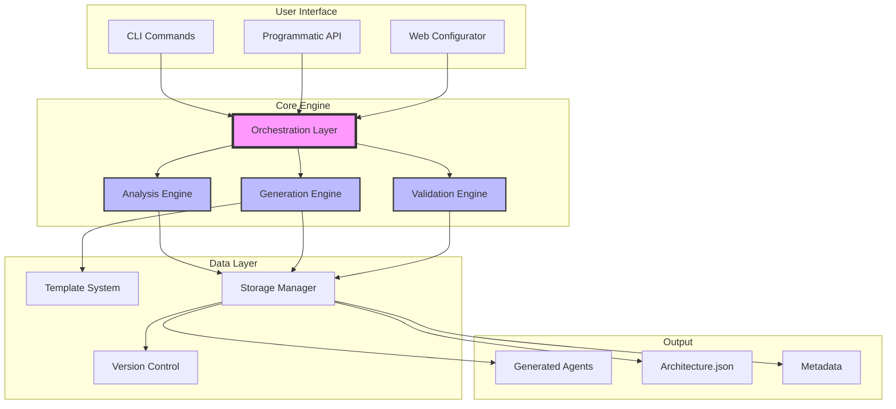
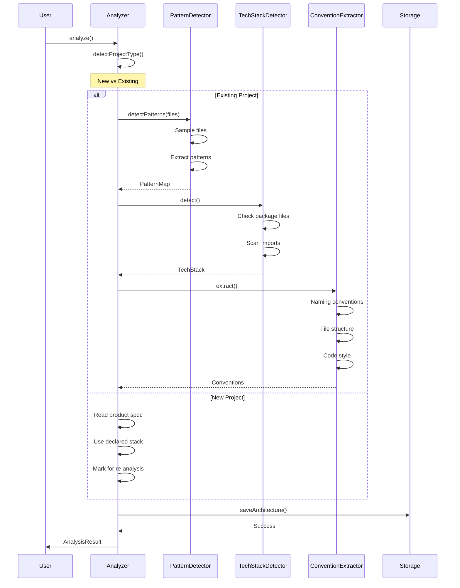
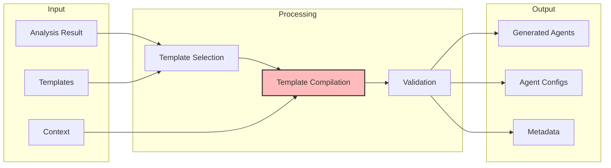
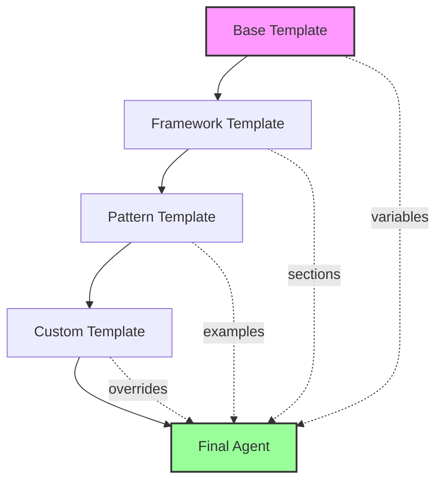
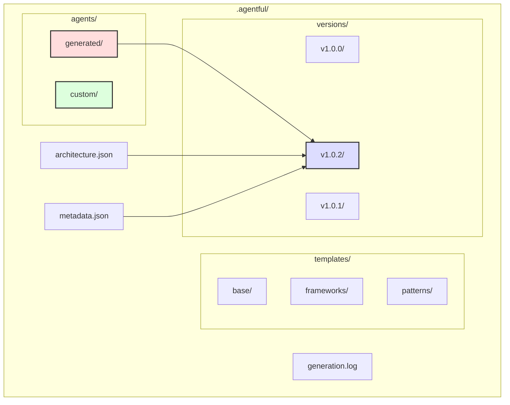
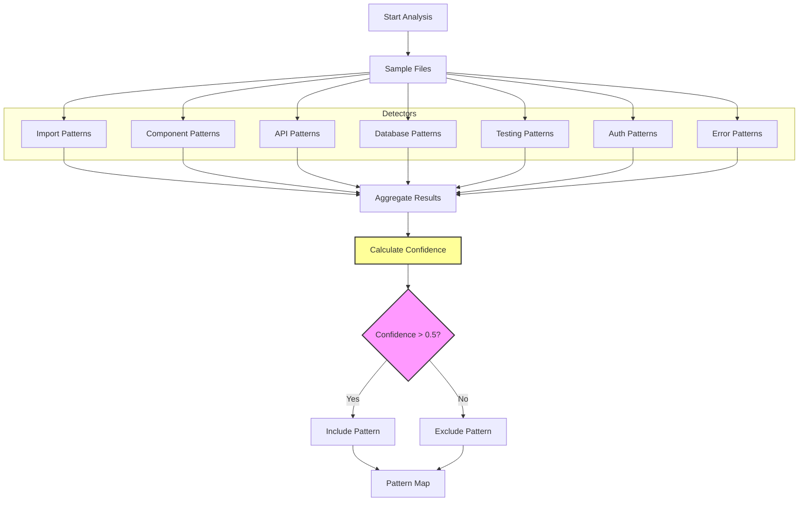
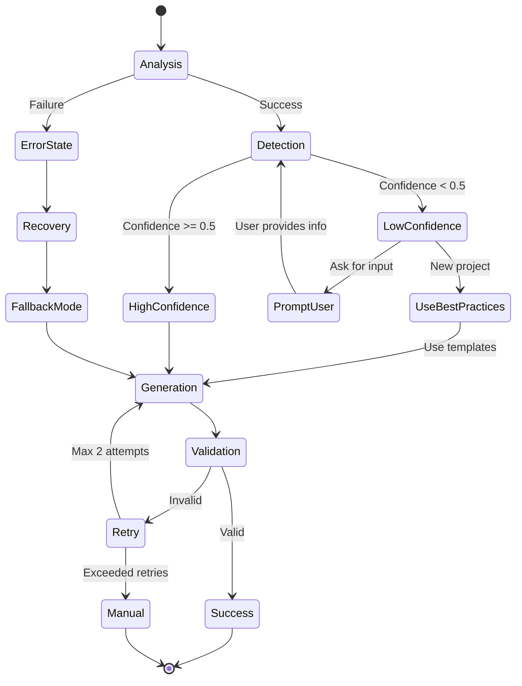
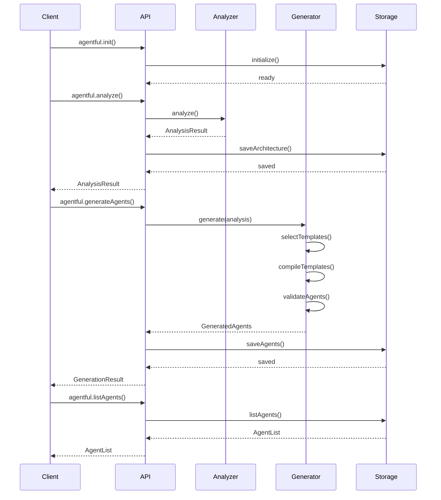
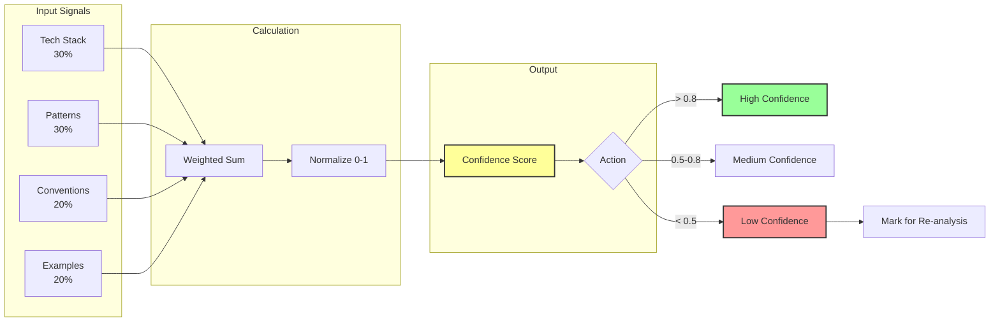
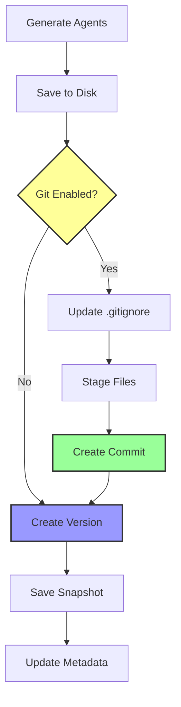

# Agent Generation System - Architecture Diagrams

## System Overview

## Analysis Flow

## Generation Pipeline

## Template Inheritance

## Storage Architecture

## Pattern Detection Strategy

## Error Recovery Flow

## API Interaction Flow

## Confidence Scoring

## Version Control Integration

