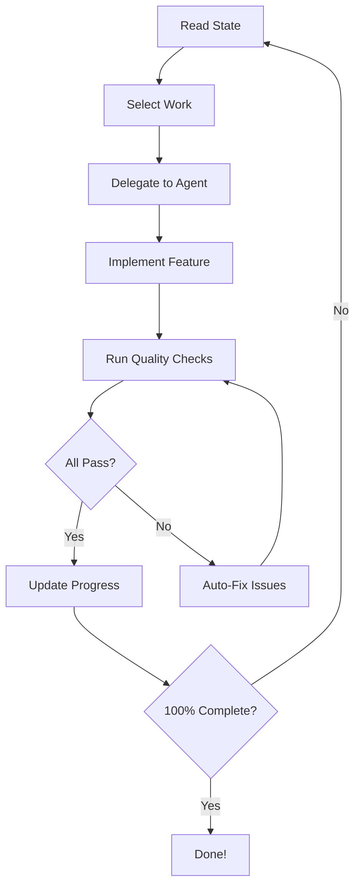

# Autonomous Development

agentful's autonomous development mode enables Claude Code to work independently, building your product 24/7 with minimal human intervention. This comprehensive guide explains how autonomous development works and how to use it safely.

## Overview

Autonomous development in agentful follows a continuous cycle:

1. **Read State** - Check progress and what's left to build
2. **Select Work** - Choose next feature/task based on priority
3. **Delegate** - Assign to specialist agent (backend, frontend, tester)
4. **Validate** - Reviewer agent checks code quality
5. **Fix** - Fixer agent resolves any issues
6. **Update Progress** - Mark work as complete
7. **Repeat** - Loop until 100% complete



## Key Components

### Orchestrator Agent

The orchestrator is the brain of autonomous development:

- **Never writes code** - only coordinates and delegates
- **Reads state files** - understands current progress
- **Selects work** - prioritizes features intelligently
- **Handles decisions** - blocks when user input needed
- **Tracks progress** - updates completion metrics

Located in: `.claude/agents/orchestrator.md`

### Quality Gates

All code must pass 6 quality gates before completion:

1. **Tests Passing** - All tests must pass
2. **TypeScript Clean** - No type errors
3. **Lint Clean** - No lint errors
4. **Dead Code Removed** - No unused exports, files, or dependencies
5. **Coverage ≥ 80%** - Test coverage threshold
6. **Security Clean** - No vulnerabilities, secrets, or debug logs

### Specialist Agents

Autonomous development delegates to specialized agents:

- **@backend** - Services, repositories, controllers, APIs
- **@frontend** - Components, pages, hooks, styling
- **@tester** - Unit, integration, and E2E tests
- **@reviewer** - Code quality validation
- **@fixer** - Automatic issue resolution

## State Management

agentful tracks state in `.agentful/` directory:

### state.json

Current work state and context:

```json
{
  "version": "1.0",
  "current_task": "Implement user authentication",
  "current_phase": "implementing",
  "iterations": 12,
  "last_updated": "2026-01-18T00:00:00Z",
  "blocked_on": ["auth-decision-001"]
}
```

### completion.json

Progress tracking for features and gates:

```json
{
  "features": {
    "authentication": {
      "status": "complete",
      "score": 100,
      "completed_at": "2026-01-18T01:00:00Z"
    },
    "user-profile": {
      "status": "in_progress",
      "score": 45,
      "notes": "Backend done, frontend pending"
    }
  },
  "gates": {
    "tests_passing": true,
    "no_type_errors": true,
    "no_dead_code": false,
    "coverage_80": false,
    "security_clean": true
  },
  "overall": 48
}
```

### decisions.json

Pending and resolved user decisions:

```json
{
  "pending": [
    {
      "id": "auth-decision-001",
      "question": "Should auth use JWT or session cookies?",
      "options": ["JWT (stateless, scalable)", "Sessions (simpler)"],
      "blocking": ["authentication"],
      "timestamp": "2026-01-18T00:00:00Z"
    }
  ],
  "resolved": []
}
```

## Work Selection Priority

The orchestrator selects work in this order:

1. **Critical failures** - Broken tests, type errors, blocked work
2. **Unblock work** - Features waiting on single small decision
3. **High priority features** - As defined in PRODUCT.md
4. **Medium priority features**
5. **Tests for completed features**
6. **Polish/Optimization** - Only when everything else done

## Decision Handling

When agentful needs your input:

1. **Stops work** on blocked features
2. **Creates decision** in `decisions.json`
3. **Moves on** to non-blocked work
4. **Notifies you** to run `/agentful-decide`

You respond by running:
```
/agentful-decide
```

Then choose from the provided options. agentful continues automatically.

## Completion Criteria

Autonomous development completes when:

- All features have `status: "complete"`
- All quality gates are `true`
- Overall completion is 100%
- No pending decisions

## Running Autonomous Mode

### Manual Mode

Start autonomous development:
```
/agentful-start
```

Check progress anytime:
```
/agentful-status
```

### 24/7 Mode (Ralph Wiggum)

For continuous overnight development:

```bash
/ralph-loop "/agentful-start" --max-iterations 50 --completion-promise "AGENTFUL_COMPLETE"
```

Ralph will loop until:
- All features complete (100%)
- All quality gates pass
- Max iterations reached

See [24/7 Development](./24-7-development.mdx) for details.

## Monitoring Progress

Monitor autonomous development through:

1. **State files** - Check `.agentful/completion.json`
2. **Status command** - Run `/agentful-status` anytime
3. **Git commits** - Each validated feature is committed
4. **Review reports** - Check `.agentful/last-review.json`

## Safety Features

### Validation Gates

Every change must pass all quality gates before progressing. This ensures:

- No broken code enters codebase
- No type errors accumulate
- No dead code remains
- Coverage is maintained
- Security issues caught early

### Automatic Recovery

The fixer agent automatically resolves:
- Dead code (unused exports, files, dependencies)
- Test coverage gaps (adds tests to reach 80%)
- Code quality issues (console.log, TODO comments)
- Type errors and lint failures

### Decision Blocking

agentful stops and asks when:
- Multiple valid approaches exist
- User preferences needed (UI design, naming)
- External dependencies required
- Trade-offs need evaluation

## Best Practices

### 1. Start with Clear PRODUCT.md

The more detailed your product spec, the less agentful needs to ask:

```markdown
## Authentication - CRITICAL

**Approach**: JWT with httpOnly cookies
**Storage**: PostgreSQL with Prisma
**Validation**: Zod schemas
**Testing**: Vitest + Playwright

**Acceptance Criteria**:
- [ ] User registration with email/password
- [ ] Email verification required
- [ ] Password reset via email
- [ ] Session management
```

### 2. Run Manual First

Before 24/7 mode:
1. Run `/agentful-start` manually
2. Monitor first few iterations
3. Check quality gates passing
4. Verify code style matches expectations
5. Then enable Ralph loop

### 3. Monitor Early Runs

Check in regularly:
```bash
# Every hour or so
/agentful-status

# Review recent changes
git log --oneline -10

# Check quality gates
cat .agentful/completion.json
```

### 4. Handle Decisions Promptly

Unanswered decisions block progress. When notified:
1. Run `/agentful-decide`
2. Review options
3. Make selection
4. agentful continues

### 5. Set Iteration Limits

For Ralph loops, always set `--max-iterations`:
```bash
# Safe: 50 iterations = overnight
/ralph-loop "/agentful-start" --max-iterations 50

# Longer: weekend development
/ralph-loop "/agentful-start" --max-iterations 200
```

## Troubleshooting

### agentful Not Starting

**Check**:
1. PRODUCT.md exists and is valid
2. `.agentful/` directory exists
3. State files are valid JSON

**Fix**:
```bash
# Reinitialize
npx @itz4blitz/agentful init
```

### Quality Gates Failing Repeatedly

**Check**:
1. `.agentful/last-review.json` for specific issues
2. If fixer can't resolve, may need manual intervention

**Fix**:
```bash
# Run validation manually
/agentful-validate

# Review specific issues
cat .agentful/last-review.json
```

### Loop Not Progressing

**Check**:
1. `.agentful/decisions.json` for pending decisions
2. `.agentful/state.json` for blockers

**Fix**:
```bash
# Answer pending decisions
/agentful-decide
```

## Next Steps

- [24/7 Development](./24-7-development.mdx) - Ralph Wiggum integration
- [Quality Gates](./quality-gates.mdx) - Detailed gate explanations
- [Recovery Strategies](./recovery-strategies.mdx) - Self-healing mechanisms
- [Monitoring](./monitoring.mdx) - Progress tracking strategies
