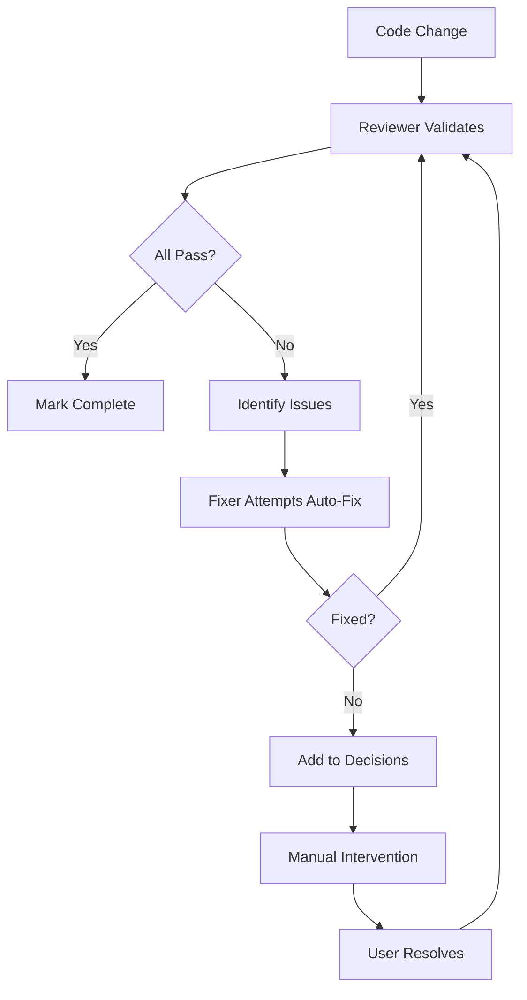

# Recovery Strategies

Agentful's self-healing capabilities automatically resolve most validation failures through the fixer agent. This guide explains how recovery works, what can be auto-fixed, and how to handle issues requiring manual intervention.

## Overview

The recovery cycle works as follows:



## Fixer Agent Capabilities

The fixer agent can automatically resolve:

### 1. Dead Code Removal

**Unused Exports**
```typescript
// Before
export function formatDate(date: Date): string {  // Unused
  return date.toISOString();
}
export function parseDate(str: string): Date {  // Used
  return new Date(str);
}

// After (fixer removes unused function)
export function parseDate(str: string): Date {
  return new Date(str);
}
```

**Unused Files**
```bash
# Fixer deletes entire file
rm src/components/OldWidget.tsx

# Removes imports from other files
# Updates barrel exports
```

**Unused Dependencies**
```bash
# Detects with depcheck
npx depcheck

# Removes from package.json
npm uninstall lodash
```

### 2. Test Coverage Gaps

**Generates Basic Tests**
```typescript
// Original code (untested)
export function capitalize(str: string): string {
  return str.charAt(0).toUpperCase() + str.slice(1);
}

// Fixer generates test
describe('capitalize', () => {
  it('should capitalize first letter', () => {
    expect(capitalize('hello')).toBe('Hello');
  });

  it('should handle empty string', () => {
    expect(capitalize('')).toBe('');
  });

  it('should handle single character', () => {
    expect(capitalize('a')).toBe('A');
  });
});
```

**Adds Edge Case Tests**
- Null/undefined inputs
- Empty strings/arrays
- Boundary values (0, -1, etc.)
- Error conditions

### 3. Code Quality Issues

**Removes Debug Statements**
```typescript
// Before
async function login(email: string, password: string) {
  console.log('Login attempt:', email);  // Remove
  console.debug('Password:', password);  // Remove
  const user = await authenticate(email, password);
  return user;
}

// After
async function login(email: string, password: string) {
  const user = await authenticate(email, password);
  return user;
}
```

**Removes Commented Code**
```typescript
// Before
// export function oldMethod() { ... }  // Remove this
export function newMethod() { ... }

// After
export function newMethod() { ... }
```

**Fixes TODO Comments**
```typescript
// Before
// TODO: Implement validation  // Fixer implements or removes
function process(input: string) {
  return input;
}

// After (fixer implements basic validation)
function process(input: string): string {
  if (!input || input.trim().length === 0) {
    throw new Error('Invalid input');
  }
  return input.trim();
}
```

### 4. TypeScript Errors

**Adds Type Annotations**
```typescript
// Before
function calculate(a, b) {  // Implicit any
  return a + b;
}

// After
function calculate(a: number, b: number): number {
  return a + b;
}
```

**Fixes Type Mismatches**
```typescript
// Before
interface User {
  name: string;
}

const user: User = { name: 'John', age: 30 };  // Error: age not in interface

// After
interface User {
  name: string;
  age?: number;  // Made optional
}

const user: User = { name: 'John', age: 30 };
```

**Installs Type Definitions**
```bash
# Detects missing types
# import express from 'express'  // No @types/express

# Installs automatically
npm install --save-dev @types/express
```

### 5. Lint Errors

**Removes Unused Variables**
```typescript
// Before
const unused = 5;
const used = 10;
console.log(used);

// After
const used = 10;
console.log(used);
```

**Fixes Import Order**
```typescript
// Before (wrong order)
import { internal } from './internal';
import React from 'react';
import lodash from 'lodash';

// After (correct order)
import React from 'react';
import lodash from 'lodash';
import { internal } from './internal';
```

**Fixes Formatting**
```typescript
// Before
const obj ={key:'value'};  // Spacing issues

// After
const obj = { key: 'value' };
```

### 6. Security Issues

**Removes Hardcoded Secrets**
```typescript
// Before
const API_KEY = "sk-1234567890abcdef";  // ❌ Never commit

// After
const API_KEY = process.env.API_KEY;

// Fixer also updates .env.example
echo "API_KEY=your_api_key_here" >> .env.example
```

**Updates Vulnerable Dependencies**
```bash
# npm audit shows vulnerability
# lodash@4.17.15 has high severity vulnerability

# Fixer updates
npm update lodash

# If breaking changes, creates decision for manual review
```

**Removes @ts-ignore**
```typescript
// Before
// @ts-ignore
const data = JSON.parse(maybeInvalid);

// After (fixer adds proper validation)
const data = JSON.parse(maybeInvalid) as unknown;
if (isValidData(data)) {
  return data;
}
throw new Error('Invalid data');
```

## Recovery Workflow

### 1. Issue Detection

Reviewer identifies issues:
```json
{
  "passed": false,
  "mustFix": [
    "Remove unused export: formatDate in src/utils/date.ts",
    "Add tests to reach 80% coverage (currently 72%)",
    "Remove console.log from src/auth/login.ts:45"
  ]
}
```

### 2. Fixer Attempts Resolution

Fixer works through issues systematically:

```typescript
// Priority 1: Quick fixes
// - Remove console.log (line 45)
// - Remove unused export

// Priority 2: Medium effort
// - Generate tests for coverage

// Priority 3: Complex fixes
// - Refactor if needed
```

### 3. Re-Validation

After fixes, reviewer runs again:

```json
{
  "passed": true,
  "summary": "All issues resolved"
}
```

### 4. Progress Update

Orchestrator marks complete:
```json
{
  "current_task": null,
  "current_phase": "idle"
}
```

## Manual Intervention Required

Some issues require human judgment:

### 1. Architectural Decisions

```typescript
// Fixer detects circular dependency
// src/a.ts imports from src/b.ts
// src/b.ts imports from src/a.ts

// Can't auto-fix - requires refactoring decision
// Creates decision in decisions.json
```

**Example Decision**:
```json
{
  "id": "arch-decision-001",
  "question": "How to resolve circular dependency between a.ts and b.ts?",
  "options": [
    "Extract shared code to c.ts",
    "Combine into single module",
    "Use dependency injection pattern"
  ],
  "blocking": ["feature-x"],
  "timestamp": "2026-01-18T00:00:00Z"
}
```

### 2. Breaking Changes

```typescript
// Fixer can't update major version
// package.json: "package": "1.0.0"
// Vulnerability fixed in "package": "2.0.0"

// Creates decision for manual approval
```

### 3. Complex Test Scenarios

```typescript
// Fixer can generate basic tests
// But complex integration tests need manual design

describe('user authentication flow', () => {
  // Fixer creates simple test
  it('should authenticate valid user', async () => {
    // ... basic test
  });

  // Manual test needed for:
  it('should handle rate limiting', async () => {
    // Complex scenario with timing
  });

  it('should handle concurrent logins', async () => {
    // Race condition testing
  });
});
```

### 4. Business Logic

```typescript
// Fixer can implement validation
// But business rules need human input

// Example: Discount calculation
function calculateDiscount(total: number, customer: Customer): number {
  // Fixer can add basic validation
  if (total <= 0) throw new Error('Invalid total');

  // But business rule needs human:
  // "VIP customers get 15% discount on orders over $100
  //  but only on Tuesdays, and not during sale periods"

  // Creates decision for business logic clarification
}
```

### 5. External Dependencies

```typescript
// Fixer can't set up external services
// Database connections, API keys, etc.

// Creates decision with setup instructions
{
  "question": "Database configuration needed",
  "context": "Add DATABASE_URL to .env",
  "instructions": "1. Create database at Supabase\n2. Add URL to .env\n3. Run migrations"
}
```

## Handling Manual Decisions

### When Decision Is Required

1. **Stop current work** on blocked feature
2. **Create decision** in `decisions.json`
3. **Continue** with non-blocked features
4. **Notify user** to run `/agentful-decide`

### Resolution Process

```bash
# User runs decision command
/agentful-decide

# Agentful presents options
❓ How to resolve circular dependency?

[1] Extract shared code to c.ts
[2] Combine into single module
[3] Use dependency injection pattern

Your choice: 1

✅ Decision recorded. Continuing development...
```

### After Resolution

1. **Decision moved** from pending to resolved
2. **Blocked feature** becomes active again
3. **Orchestrator resumes** work on feature
4. **Fixer implements** based on decision

## Recovery Patterns

### Pattern 1: Immediate Fix

```typescript
// Issue found
console.log in src/auth.ts:45

// Immediate fix
// Fixer removes line
// Re-validate
// Pass
```

### Pattern 2: Iterative Fix

```typescript
// Issue found
Coverage at 65%, need 80%

// Iteration 1: Fixer adds tests for untested functions
// Coverage: 72%

// Iteration 2: Fixer adds edge case tests
// Coverage: 78%

// Iteration 3: Fixer adds integration tests
// Coverage: 82%

// Pass
```

### Pattern 3: Manual Decision Loop

```typescript
// Issue found
Circular dependency detected

// Can't fix
// Create decision

// User answers
// Extract shared code

// Fixer implements
// Re-validate
// Pass
```

### Pattern 4: Cascading Fixes

```typescript
// Issue 1 found
Unused export in utils.ts

// Fixer removes export
// But now tests fail (they imported the export)

// Issue 2 found
Test failures

// Fixer removes dead tests
// But now coverage drops

// Issue 3 found
Coverage below 80%

// Fixer adds new tests
// Pass
```

## Monitoring Recovery

### Track Fixer Activity

```bash
# View what fixer is doing
tail -f .agentful/fixer.log

# Check recent fixes
cat .agentful/last-fix.json

# View fix history
cat .agentful/completion.json | jq '.fix_history'
```

### Fix Report Format

```json
{
  "timestamp": "2026-01-18T00:00:00Z",
  "fixed": [
    "Removed unused export: formatDate in src/utils/date.ts",
    "Deleted unused file: src/components/OldWidget.tsx",
    "Removed console.log from src/auth/login.ts:45"
  ],
  "remaining": [
    "Coverage at 78% (added tests, need 2 more%)"
  ],
  "blocked": []
}
```

### Recovery Metrics

Track these metrics:

```json
{
  "auto_fix_rate": 0.85,  // 85% of issues auto-fixed
  "manual_decision_rate": 0.15,  // 15% need human input
  "avg_fix_iterations": 2.3,  // Average 2.3 loops to resolve
  "critical_fixes": 12,  // Number of critical issues fixed
  "quality_fixes": 45  // Number of quality issues fixed
}
```

## Troubleshooting Recovery

### Fixer Can't Resolve Issue

**Symptoms**:
- Same issue appears in multiple reviews
- `remaining` array never empties
- Iteration count increases without progress

**Diagnosis**:
```bash
# Check what's blocking
cat .agentful/last-review.json | jq '.mustFix'

# Check fix attempts
cat .agentful/last-fix.json | jq '.remaining'
```

**Solutions**:
1. Run `/agentful-validate` manually
2. Review specific issues
3. Fix manually if needed
4. Check if decision needed but not created

### Fixer Creates Breaking Changes

**Symptoms**:
- Tests pass after fix but functionality broken
- Type errors fixed but logic wrong

**Prevention**:
```bash
# Always run tests after fixes
npm test

# Check git diff before commit
git diff

# If suspicious, reset and fix manually
git reset --hard HEAD
```

### Infinite Fix Loop

**Symptoms**:
- Fixer fixes issue
- Reviewer finds it again
- Loop never ends

**Common Causes**:
1. **Tool configuration wrong** - Fixer and reviewer using different rules
2. **Generated code** - Fixer removes code that gets regenerated
3. **Conflicting rules** - One rule requires what another forbids

**Solutions**:
1. Stop the loop (Ctrl+C or kill Ralph)
2. Review configuration files
3. Align tool settings
4. Consider excluding generated files from checks

### Recovery Deletes Useful Code

**Symptoms**:
- Fixer removes code you need
- Exports deleted but used in tests

**Prevention**:
```typescript
// Mark intentionally unused exports
// eslint-disable-next-line unused-imports/no-unused-vars
export { experimentalFeature } from './experimental';

// Or use barrel exports selectively
// public.ts - exports for external use
// internal.ts - exports for internal use only
```

**Recovery**:
```bash
# Restore from git
git log --find-renames --name-status  # Find deletion
git checkout <commit> -- path/to/file
```

## Best Practices

### 1. Review Auto-Fixes

Regularly review what fixer is doing:
```bash
# Daily review
git log --author="fixer" --since="1 day ago" --patch
```

### 2. Test Critical Paths

After auto-fixes, manually test:
- Authentication flows
- Payment processing
- Data mutations
- External integrations

### 3. Monitor Fix Patterns

If fixer keeps fixing same type of issue:
- Update agent instructions to prevent issue
- Adjust lint rules
- Add pre-commit hooks

### 4. Keep Decisions Small

Break complex decisions into smaller ones:
```json
// Bad: Giant decision
{
  "question": "How to refactor entire authentication system?"
}

// Good: Small decisions
{
  "question": "Use JWT or sessions?"
}
{
  "question": "Store tokens in localStorage or cookies?"
}
```

### 5. Document Decisions

Resolved decisions should inform future work:
```json
{
  "resolved": [
    {
      "id": "auth-001",
      "question": "JWT or sessions?",
      "answer": "JWT with httpOnly cookies",
      "reasoning": "Scalability for future microservices",
      "timestamp": "2026-01-18T00:00:00Z"
    }
  ]
}
```

## Advanced Recovery

### Custom Fix Strategies

Define custom fix patterns in `.claude/agents/fixer.md`:

```markdown
## Custom Fix: Add Error Logging

When adding try/catch, also add logging:

```typescript
try {
  await operation();
} catch (error) {
  logger.error('Operation failed', { error });
  throw error;
}
```
```

### Recovery Hooks

Add custom recovery steps:

```markdown
## After Database Connection Failure

1. Check DATABASE_URL in .env
2. Test connection: npm run db:test
3. Run migrations: npm run db:migrate
4. Retry operation
```

## Next Steps

- [Autonomous Development Overview](./index.mdx) - Back to overview
- [Quality Gates](./quality-gates.mdx) - What triggers recovery
- [Monitoring](./monitoring.mdx) - Track recovery effectiveness
