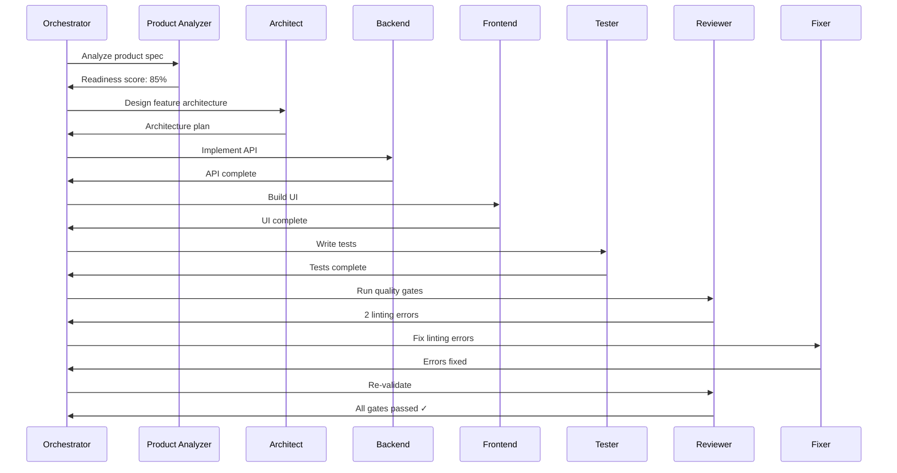

# Agent Architecture

agentful's architecture centers around a **hub-and-spoke model** where the Orchestrator coordinates all specialist agents. Each agent has clear boundaries, knows when to delegate, and communicates status back to the Orchestrator.

<div style={{
  margin: '3rem auto',
  maxWidth: '800px',
  padding: '2rem',
  background: 'linear-gradient(135deg, rgba(15, 23, 42, 0.6) 0%, rgba(15, 23, 42, 0.8) 100%)',
  borderRadius: '1rem',
  border: '1px solid rgba(16, 185, 129, 0.2)'
}}>
  
</div>

## Core Principles

### 1. Clear Separation of Concerns

Each agent focuses on a specific domain:

- **Product Analyzer** - Requirements analysis, gap detection
- **Architect** - System design, tech stack decisions
- **Backend** - APIs, databases, server logic
- **Frontend** - UI components, state, client code
- **Tester** - Unit, integration, and E2E tests
- **Reviewer** - Quality gates, validation checks
- **Fixer** - Automated issue remediation

### 2. Hub-and-Spoke Delegation

The **Orchestrator** never writes code directly. Instead, it:

1. Analyzes the current phase of work
2. Determines which specialist is needed
3. Delegates the task with clear context
4. Receives status and results
5. Coordinates the next step

### 3. Bidirectional Communication

Agents communicate back to the Orchestrator when:

- Task is complete
- Decision needed from human
- Blocker encountered
- Quality gate failed

This creates a feedback loop that keeps work flowing while maintaining quality.

---

## Agent Responsibilities

### Orchestrator 🎯

**Role**: Workflow coordinator and task delegator

**Responsibilities**:
- Parse product specs and build work queues
- Delegate tasks to appropriate specialists
- Track completion percentage
- Manage decision checkpoints
- Never write code directly

**Delegates to**: All specialist agents

---

### Product Analyzer 📊

**Role**: Requirements analysis and product spec validation

**Responsibilities**:
- Analyze product specifications for completeness
- Detect gaps, ambiguities, and conflicts
- Score readiness for development
- Suggest improvements to product docs

**Outputs**: Gap reports, readiness scores, improvement suggestions

---

### Architect 🏗️

**Role**: System design and technical planning

**Responsibilities**:
- Detect tech stack from codebase
- Design system architecture
- Generate domain-specific agents
- Establish coding patterns and conventions
- Create architectural decision records (ADRs)

**Outputs**: Architecture docs, generated agents, tech stack config

---

### Backend ⚙️

**Role**: Server-side development

**Responsibilities**:
- API endpoints and routes
- Database schemas and migrations
- Authentication and authorization
- Business logic and domain models
- Server configuration

**Delegates to**: `@tester` for backend tests, `@reviewer` for API validation

---

### Frontend 🎨

**Role**: Client-side development

**Responsibilities**:
- UI components and pages
- State management
- Form handling and validation
- Responsive design
- Client-side routing
- Asset optimization

**Delegates to**: `@tester` for component tests, `@reviewer` for accessibility checks

---

### Tester 🧪

**Role**: Test generation and execution

**Responsibilities**:
- Write unit tests
- Write integration tests
- Write E2E tests
- Ensure 80%+ code coverage
- Maintain test infrastructure

**Outputs**: Test files, coverage reports

---

### Reviewer 🔍

**Role**: Quality validation and production readiness

**Responsibilities**:
- Run all quality gates (type checking, linting, tests, coverage)
- Detect dead code and unused dependencies
- Security vulnerability scanning
- Performance analysis
- Accessibility validation

**Outputs**: Validation reports, quality scores

---

### Fixer 🔧

**Role**: Automated issue remediation

**Responsibilities**:
- Fix type errors
- Fix linting issues
- Fix failing tests
- Remove dead code
- Update dependencies with vulnerabilities

**Triggered by**: Failed validation from `@reviewer`

---

## Workflow Example

Here's how agents collaborate to implement a new feature:



---

## Agent Communication Protocol

Agents communicate through structured messages:

### Status Updates

```json
{
  "agent": "backend",
  "status": "complete",
  "artifacts": ["/api/users.ts", "/lib/db/users.ts"],
  "next_steps": "Request @tester to write tests"
}
```

### Decision Requests

```json
{
  "agent": "architect",
  "status": "blocked",
  "decision": {
    "question": "Use PostgreSQL or MongoDB for user data?",
    "options": ["PostgreSQL", "MongoDB"],
    "context": "User data is relational, but we may need flexible schemas for metadata"
  }
}
```

### Quality Gate Results

```json
{
  "agent": "reviewer",
  "status": "failed",
  "gates": {
    "type_check": "passed",
    "lint": "failed",
    "tests": "passed",
    "coverage": "passed",
    "security": "passed",
    "dead_code": "passed"
  },
  "failures": [
    { "gate": "lint", "count": 3, "details": "..." }
  ]
}
```

---

## Adding Custom Agents

agentful can generate domain-specific agents based on your codebase patterns:

```bash
# Architect agent analyzes your code and generates specialists
/agentful-start

# Generated agents appear in .claude/agents/
# Examples:
# - auth-agent.md - Authentication patterns
# - payment-agent.md - Payment processing
# - notification-agent.md - Email/SMS/push
```

Custom agents follow the same delegation principles and quality standards as core agents.

---

## Next Steps

- [Run your first agentful session →](/getting-started/first-project)
- [Configure quality gates →](/getting-started/configuration)
- [View all available commands →](/commands/agentful)
