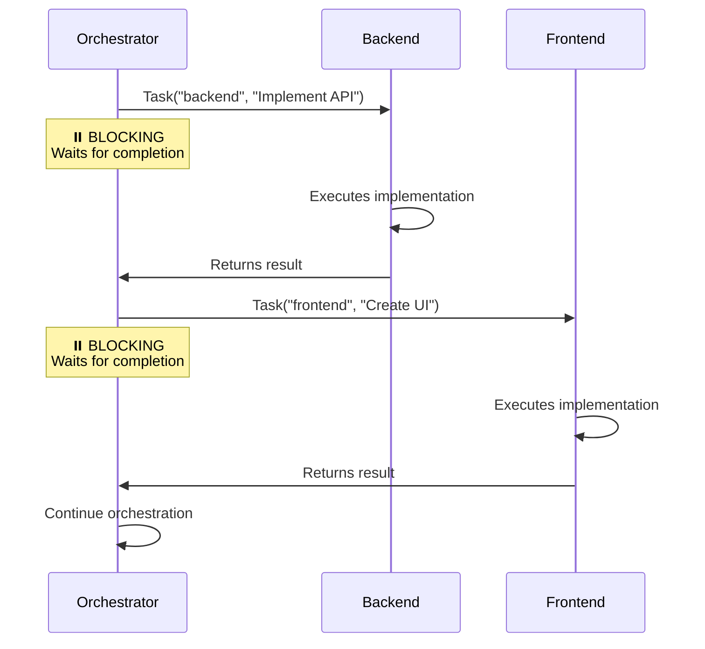
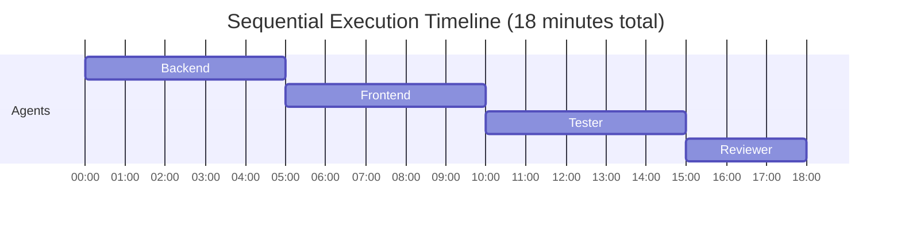
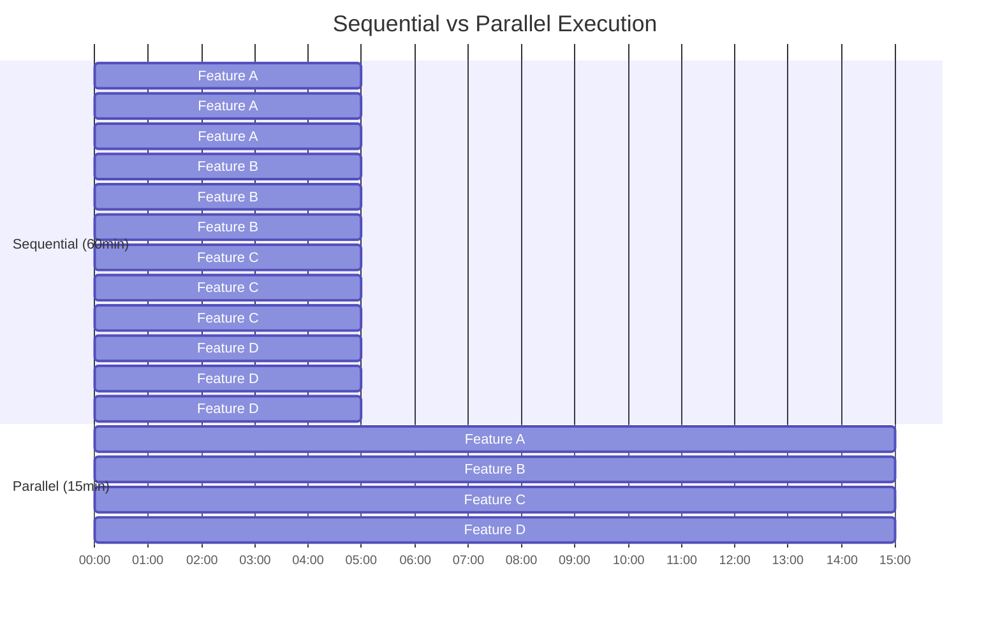

import { DiagramModal } from '../../components/DiagramModal'

# Background Agent Patterns

This document explains how agentful handles background and parallel agent execution, including current capabilities, limitations, and future roadmap.

## Overview

In agentful, agents can delegate work to other agents using the `Task()` tool. This creates a delegation chain where work flows from orchestrator to specialists (backend, frontend, tester, etc.).

**Current State (v0.4.x):**
- Sequential execution only (agents run one at a time)
- Blocking Task() calls
- Agent queue with priority-based scheduling

**Future State (planned for SDK support):**
- Parallel execution for independent tasks
- Non-blocking TaskGroup() API
- Dependency graph resolution

## Current Implementation: Sequential Execution

### How Task() Works Today

The `Task()` tool spawns an agent synchronously and blocks until completion:

```javascript
// Orchestrator delegates to backend
Task("backend", "Implement user authentication API");
// ⏸️ Orchestrator WAITS for backend to finish

// After backend completes, delegate to frontend
Task("frontend", "Create login page");
// ⏸️ Orchestrator WAITS for frontend to finish
```

**Execution Flow:**

<DiagramModal title="Sequential Execution Flow">



</DiagramModal>

### State Tracking During Execution

The orchestrator tracks agent execution in `.agentful/state.json`:

```json
{
  "current_agent": "backend",
  "agent_start_time": "2026-01-20T10:30:00Z",
  "agent_timeout": 600000,
  "agent_history": [
    {
      "agent": "backend",
      "task": "Implement auth API",
      "started_at": "2026-01-20T10:30:00Z",
      "completed_at": "2026-01-20T10:35:00Z",
      "duration_ms": 300000,
      "status": "completed"
    }
  ]
}
```

### Agent Queue Pattern

When multiple agents need to run, they're queued and executed sequentially:

```javascript
// All these run ONE AT A TIME
const tasks = [
  { agent: "backend", description: "Implement login API" },
  { agent: "frontend", description: "Create login form" },
  { agent: "tester", description: "Write auth tests" },
  { agent: "reviewer", description: "Validate all changes" }
];

for (const task of tasks) {
  console.log(`Starting ${task.agent}...`);
  Task(task.agent, task.description);
  console.log(`${task.agent} completed`);
}
```

**Timeline:**

<DiagramModal title="Sequential Task Timeline">



</DiagramModal>

Total: 18 minutes (sequential)

## Current Workarounds for Concurrency

Since agents run sequentially, here are patterns to optimize throughput:

### 1. Task Decomposition

Break large tasks into smaller chunks for better progress visibility:

**Bad (one large task):**
```javascript
// Backend might timeout, no visibility into progress
Task("backend", "Implement entire authentication domain with login, logout, password reset, email verification, 2FA, session management");
```

**Good (smaller tasks):**
```javascript
// Better visibility, easier to resume if interrupted
Task("backend", "Implement login endpoint (POST /api/auth/login)");
Task("backend", "Implement logout endpoint (POST /api/auth/logout)");
Task("backend", "Implement password reset endpoints");
Task("backend", "Implement email verification");
```

### 2. TodoWrite for Progress Tracking

Use `TodoWrite` to show which tasks are in queue:

```javascript
// Show all planned work upfront
TodoWrite([
  { content: "Implement backend API", status: "in_progress", activeForm: "Implementing API" },
  { content: "Create frontend UI", status: "pending", activeForm: "Creating UI" },
  { content: "Write tests", status: "pending", activeForm: "Writing tests" },
  { content: "Run validation", status: "pending", activeForm: "Validating" }
]);

Task("backend", "Implement API");
// Update status after each task completes
```

### 3. Checkpoint-Resume Pattern

Save progress frequently to enable resumption:

```javascript
// Read completion state
const completion = JSON.parse(Read(".agentful/completion.json"));

// Find incomplete features
const incomplete = Object.entries(completion.features)
  .filter(([_, feature]) => feature.status !== "complete");

// Process one at a time, updating state after each
for (const [name, feature] of incomplete) {
  Task("backend", `Implement ${name}`);

  // Checkpoint: Update completion
  completion.features[name].status = "in_progress";
  Write(".agentful/completion.json", JSON.stringify(completion, null, 2));

  Task("tester", `Test ${name}`);

  // Checkpoint: Mark complete
  completion.features[name].status = "complete";
  Write(".agentful/completion.json", JSON.stringify(completion, null, 2));
}
```

### 4. Multiple agentful-start Sessions

For truly parallel work, use multiple terminal sessions:

```bash
# Terminal 1: Work on authentication
/agentful-start
User: "Implement authentication feature"

# Terminal 2: Work on user profile (independent)
/agentful-start
User: "Implement user profile feature"
```

**Caution:** This can cause merge conflicts. Only use for truly independent features.

### 5. Ralph Loop Integration

For long-running autonomous work, leverage the Ralph Wiggum loop:

```javascript
// In orchestrator, structure work for Ralph to continue
while (!isComplete()) {
  // Pick next feature
  const nextFeature = getNextFeature();

  // Delegate (Ralph waits for completion)
  Task("backend", `Implement ${nextFeature.name}`);
  Task("frontend", `Create UI for ${nextFeature.name}`);
  Task("tester", `Test ${nextFeature.name}`);

  // Update state
  updateCompletion(nextFeature);

  // Ralph continues to next iteration
}

// Signal completion
return "<promise>AGENTFUL_COMPLETE</promise>";
```

## Limitations of Sequential Execution

### Performance Impact

**Example: Building 4 independent features**

<DiagramModal title="Sequential vs Parallel Execution Comparison">



</DiagramModal>

**Sequential:** 60 minutes total
**Parallel:** 15 minutes total (4x faster!)

### Resource Underutilization

When backend agent is writing code:
- Frontend agent is idle (could be working on UI)
- Tester agent is idle (could be writing test fixtures)
- Reviewer agent is idle (could be checking earlier work)

Sequential execution means only 1 agent active at a time, even when multiple agents could work independently.

### User Experience

Long development cycles feel slow:
- User requests "Build authentication and user profile"
- Waits 30+ minutes for sequential completion
- Could be 10 minutes if agents worked in parallel

## Future Design: Parallel Execution

When the Claude Code Agent SDK adds parallel execution support, agentful will implement:

### TaskGroup() API Proposal

```javascript
// Proposed API for parallel execution
const results = await TaskGroup([
  { agent: "backend", task: "Implement auth API", timeout: 600000 },
  { agent: "frontend", task: "Create login UI", timeout: 600000 }
], {
  mode: "parallel",  // Run simultaneously
  failFast: false,   // Continue even if one fails
  maxConcurrency: 4  // Limit concurrent agents
});

// results = [
//   { agent: "backend", status: "success", duration: 300000 },
//   { agent: "frontend", status: "success", duration: 280000 }
// ]
```

### Dependency Graph Resolution

Automatically detect which tasks can run in parallel:

```javascript
// Define tasks with dependencies
const tasks = [
  {
    id: "api",
    agent: "backend",
    task: "Implement API",
    dependencies: [] // No dependencies, can start immediately
  },
  {
    id: "ui",
    agent: "frontend",
    task: "Create UI",
    dependencies: [] // No dependencies, can start immediately
  },
  {
    id: "tests",
    agent: "tester",
    task: "Write tests",
    dependencies: ["api", "ui"] // Needs both API and UI complete
  },
  {
    id: "review",
    agent: "reviewer",
    task: "Validate code",
    dependencies: ["tests"] // Needs tests complete
  }
];

// Execution plan (auto-generated):
// Wave 1 (parallel): api, ui
// Wave 2 (after wave 1): tests
// Wave 3 (after wave 2): review
```

**Timeline with parallelization:**
```
0:00 → api and ui start IN PARALLEL
0:05 → api completes
0:05 → ui completes
0:05 → tests starts (both dependencies met)
0:10 → tests completes
0:10 → review starts
0:13 → review completes, ALL DONE
```

Total: 13 minutes (vs 18 minutes sequential)

### Smart Parallelization Detection

Automatically detect which agents can run in parallel:

#### Safe to Parallelize

**Independent Features:**
```javascript
// These can run in parallel (no shared files)
TaskGroup([
  { agent: "backend", task: "Implement auth API" },
  { agent: "backend", task: "Implement user profile API" }
]);
// No file conflicts: src/auth/* vs src/profile/*
```

**Different Domains:**
```javascript
// Backend and frontend work on different files
TaskGroup([
  { agent: "backend", task: "Implement API" },  // src/api/*
  { agent: "frontend", task: "Create UI" }      // src/components/*
]);
// No conflicts: backend touches server code, frontend touches client code
```

#### NOT Safe to Parallelize

**Same File Modifications:**
```javascript
// DANGER: Both might modify same file
TaskGroup([
  { agent: "backend", task: "Add endpoint to user.service.ts" },
  { agent: "backend", task: "Add endpoint to user.service.ts" }
]);
// ❌ Merge conflict likely
```

**Dependent Work:**
```javascript
// DANGER: Frontend needs backend API to exist
TaskGroup([
  { agent: "backend", task: "Implement auth API" },
  { agent: "frontend", task: "Call auth API in login form" }
]);
// ❌ Frontend might start before API exists
```

### State Schema Changes

Extend `.agentful/state.json` for parallel tracking:

```json
{
  "execution_mode": "parallel",
  "active_agents": [
    {
      "agent": "backend",
      "task": "Implement auth API",
      "started_at": "2026-01-20T10:30:00Z",
      "timeout": 600000,
      "status": "running"
    },
    {
      "agent": "frontend",
      "task": "Create login UI",
      "started_at": "2026-01-20T10:30:05Z",
      "timeout": 600000,
      "status": "running"
    }
  ],
  "agent_pool": {
    "max_concurrent": 4,
    "available_slots": 2,
    "queue": [
      {
        "agent": "tester",
        "task": "Write tests",
        "dependencies": ["backend", "frontend"],
        "priority": 2
      }
    ]
  }
}
```

### Agent Pool Management

Limit concurrent agents to prevent resource exhaustion:

```javascript
class AgentPool {
  constructor(maxConcurrent = 4) {
    this.maxConcurrent = maxConcurrent;
    this.active = new Set();
    this.queue = [];
  }

  async execute(agent, task) {
    // Wait for available slot
    while (this.active.size >= this.maxConcurrent) {
      await this.waitForSlot();
    }

    // Mark as active
    this.active.add(agent);

    try {
      // Execute task
      const result = await Task(agent, task);
      return result;
    } finally {
      // Release slot
      this.active.delete(agent);
      this.processQueue();
    }
  }
}

// Usage
const pool = new AgentPool(4);
await Promise.all([
  pool.execute("backend", "Task 1"),
  pool.execute("frontend", "Task 2"),
  pool.execute("tester", "Task 3"),
  // Queues until slot available:
  pool.execute("reviewer", "Task 4"),
  pool.execute("backend", "Task 5")
]);
```

## Code Examples

### Example 1: Current Sequential Pattern

How it works today in orchestrator:

```javascript
// File: .claude/agents/orchestrator.md

// Read feature from product spec
const feature = getNextFeature();

console.log(`Building feature: ${feature.name}`);

// Step 1: Backend implementation
console.log("Step 1/4: Backend implementation...");
Task("backend", `Implement ${feature.name} API per spec`);

// Step 2: Frontend implementation
console.log("Step 2/4: Frontend implementation...");
Task("frontend", `Create ${feature.name} UI per spec`);

// Step 3: Tests
console.log("Step 3/4: Writing tests...");
Task("tester", `Write tests for ${feature.name}`);

// Step 4: Validation
console.log("Step 4/4: Validating quality...");
Task("reviewer", `Review ${feature.name} changes`);

console.log(`✓ Feature ${feature.name} complete`);
```

### Example 2: Proposed Parallel Pattern

Future API when SDK supports it:

```javascript
// File: .claude/agents/orchestrator.md (future)

const feature = getNextFeature();

console.log(`Building feature: ${feature.name} (parallel mode)`);

// Phase 1: Implementation (parallel)
console.log("Phase 1: Parallel implementation...");
const [backendResult, frontendResult] = await TaskGroup([
  { agent: "backend", task: `Implement ${feature.name} API` },
  { agent: "frontend", task: `Create ${feature.name} UI` }
], { mode: "parallel" });

// Phase 2: Testing (after implementation)
console.log("Phase 2: Testing...");
const testResult = await Task("tester", `Write tests for ${feature.name}`);

// Phase 3: Review (after tests)
console.log("Phase 3: Validation...");
const reviewResult = await Task("reviewer", `Review ${feature.name}`);

console.log(`✓ Feature ${feature.name} complete (60% faster!)`);
```

### Example 3: Hybrid Approach

Mix of parallel and sequential when needed:

```javascript
// Build multiple features with smart parallelization
const features = ["authentication", "user-profile", "notifications"];

// Phase 1: Implement all features in parallel
console.log("Phase 1: Parallel feature implementation...");
const implResults = await TaskGroup(
  features.flatMap(name => [
    { agent: "backend", task: `Implement ${name} API` },
    { agent: "frontend", task: `Create ${name} UI` }
  ]),
  { mode: "parallel", maxConcurrency: 4 }
);

// Phase 2: Test all features in parallel
console.log("Phase 2: Parallel testing...");
const testResults = await TaskGroup(
  features.map(name => ({
    agent: "tester",
    task: `Write tests for ${name}`
  })),
  { mode: "parallel", maxConcurrency: 3 }
);

// Phase 3: Single review of all changes (sequential)
console.log("Phase 3: Full codebase review...");
await Task("reviewer", "Review all changes");

console.log("✓ All features complete");
```

### Example 4: Error Handling for Parallel Execution

```javascript
// Parallel execution with error recovery
const tasks = [
  { id: "auth-api", agent: "backend", task: "Implement auth API" },
  { id: "auth-ui", agent: "frontend", task: "Create auth UI" },
  { id: "profile-api", agent: "backend", task: "Implement profile API" }
];

try {
  const results = await TaskGroup(tasks, {
    mode: "parallel",
    failFast: false, // Continue even if one fails
    timeout: 600000
  });

  // Check results
  const failures = results.filter(r => r.status === "failed");
  const successes = results.filter(r => r.status === "success");

  console.log(`✓ ${successes.length} tasks completed`);

  if (failures.length > 0) {
    console.log(`✗ ${failures.length} tasks failed`);

    // Retry failed tasks sequentially with more context
    for (const failure of failures) {
      console.log(`Retrying: ${failure.id}`);
      try {
        await Task(failure.agent, failure.task);
        console.log(`✓ Retry successful: ${failure.id}`);
      } catch (error) {
        console.log(`✗ Retry failed: ${failure.id}`);
        // Add to decisions.json for user intervention
        addBlockingDecision({
          question: `Task ${failure.id} failed twice. How to proceed?`,
          options: ["Skip and continue", "Manual implementation", "Simplify requirements"],
          blocking: [failure.id]
        });
      }
    }
  }
} catch (error) {
  console.error("Parallel execution error:", error);
  // Fall back to sequential execution
  console.log("Falling back to sequential mode...");
  for (const task of tasks) {
    await Task(task.agent, task.task);
  }
}
```

## Performance Implications

### Sequential Execution (Current)

**Advantages:**
- Simple, predictable execution order
- Easier to debug (one agent at a time)
- No merge conflicts between agents
- Lower memory usage (one agent active)
- State tracking is straightforward

**Disadvantages:**
- Slower total execution time
- Resource underutilization (idle agents)
- Poor user experience for large projects
- No benefit from independent work

### Parallel Execution (Future)

**Advantages:**
- Much faster total execution time
- Better resource utilization (multiple agents active)
- Improved user experience
- Scales better for large projects

**Disadvantages:**
- More complex state management
- Risk of merge conflicts
- Higher memory usage (multiple agents)
- More complex error handling
- Requires dependency tracking

### Comparison Table

| Metric | Sequential | Parallel (4 agents) | Improvement |
|--------|-----------|---------------------|-------------|
| 10 independent tasks (5min each) | 50 min | 12.5 min | 4x faster |
| Memory usage | Low (~500MB) | Medium (~2GB) | 4x more |
| CPU utilization | 25% | 90% | 3.6x better |
| Debug complexity | Low | High | - |
| Risk of conflicts | None | Medium | - |

## Migration Path

When SDK adds parallel support, agentful will migrate gradually:

### Phase 1: Opt-in Parallel Mode

```javascript
// File: .agentful/state.json
{
  "execution_mode": "sequential", // Default
  "parallel_mode": {
    "enabled": false,
    "max_concurrent": 4
  }
}
```

Users can enable:
```bash
/agentful-config --parallel --max-concurrent 4
```

### Phase 2: Smart Auto-Detection

Automatically detect when parallelization is safe:

```javascript
// Orchestrator auto-detects independent work
const features = analyzeFeatures();

if (canRunInParallel(features)) {
  console.log("✓ Features are independent, using parallel mode");
  await TaskGroup(features, { mode: "parallel" });
} else {
  console.log("⚠ Features have dependencies, using sequential mode");
  for (const feature of features) {
    await Task(feature.agent, feature.task);
  }
}
```

### Phase 3: Default Parallel

Make parallel the default with safety checks:

```javascript
// Default to parallel with safeguards
try {
  await TaskGroup(tasks, {
    mode: "parallel",
    conflictDetection: true, // Prevent file conflicts
    dependencyCheck: true    // Respect dependencies
  });
} catch (ConflictError) {
  // Fall back to sequential
  console.log("Conflict detected, falling back to sequential");
  for (const task of tasks) {
    await Task(task.agent, task.task);
  }
}
```

## Recommendations

### For Current Users (v0.4.x)

Until parallel execution is supported:

1. **Break down large tasks** into smaller chunks for better visibility
2. **Use TodoWrite** to show progress across multiple sequential tasks
3. **Implement checkpoint-resume** patterns for long-running work
4. **Leverage Ralph loops** for autonomous continuation
5. **Use multiple sessions** only for truly independent features

### For Framework Contributors

When implementing parallel execution:

1. **Start with TaskGroup() API** for explicit parallelization
2. **Add dependency tracking** to prevent race conditions
3. **Implement conflict detection** to catch file merge issues early
4. **Add agent pool limits** to prevent resource exhaustion
5. **Support graceful fallback** to sequential mode when needed
6. **Track parallel execution** in state.json for debugging
7. **Test thoroughly** with various feature combinations

### For SDK Developers

To enable agentful parallelization:

1. **Add Task() async support** - Return promises instead of blocking
2. **Provide TaskGroup() API** - Run multiple agents concurrently
3. **Add timeout control** per task in group
4. **Support result collection** from parallel executions
5. **Enable cancellation** of running task groups
6. **Provide progress events** for UI updates

## Related Documentation

- [Orchestrator Agent](/agents/orchestrator) - Current delegation patterns
- [State Schema Reference](/reference/state-schema) - State file structure
- [Agent Communication](/agents/index#agent-communication) - How agents coordinate
- [Timeout Management](/agents/orchestrator#agent-timeout-management) - Handling long-running agents

## Future Enhancements

Ideas for future parallel execution improvements:

### 1. Agent Affinity

Pin agents to specific tasks for better caching:

```javascript
TaskGroup([
  { agent: "backend", task: "Task 1", affinity: "node-1" },
  { agent: "backend", task: "Task 2", affinity: "node-1" }
]);
// Both run on same agent instance, sharing context
```

### 2. Progress Streaming

Real-time updates from parallel agents:

```javascript
const group = TaskGroup([...], {
  onProgress: (agent, progress) => {
    console.log(`${agent}: ${progress.percentage}% complete`);
  }
});
```

### 3. Resource-Aware Scheduling

Adjust concurrency based on system resources:

```javascript
const pool = new AgentPool({
  maxConcurrent: "auto", // Detect based on CPU/memory
  cpuThreshold: 0.8,     // Reduce if CPU > 80%
  memoryThreshold: 0.9   // Reduce if memory > 90%
});
```

### 4. Speculative Execution

Start likely-needed tasks early:

```javascript
// Start tests speculatively while review runs
const review = Task("reviewer", "Review code");
const tests = Task("tester", "Write tests", { speculative: true });

await review;
if (review.passed) {
  await tests; // Tests already running
} else {
  tests.cancel(); // Cancel if review failed
}
```

## Summary

**Today (v0.4.x):**
- Sequential execution only
- Use workarounds: task decomposition, TodoWrite, checkpoints
- Simple but slower

**Tomorrow (future SDK support):**
- Parallel execution with TaskGroup()
- Dependency graph resolution
- Much faster, more complex

**Recommendation:** Design features assuming sequential execution today, but structure them to benefit from parallelization later (independent features, clear dependencies, checkpoint-based progress).
