# Git Worktrees

Git worktrees let you run multiple agentful agents locally in parallel branches. Each worktree maintains independent state while sharing the git repository, enabling true parallel local development.

## How It Works

Git worktrees allow you to check out multiple branches simultaneously in different directories. agentful works naturally with this pattern because:

- **Independent state** - Each worktree has its own `.agentful/` directory (gitignored)
- **Branch-specific context** - Conversation history, progress files, and optional `.claude/product/` docs are branch-specific
- **No coordination** - Worktrees don't coordinate with each other, enabling true parallel work

```mermaid
graph TB
    subgraph SharedGit[Shared Git Database]
        GitDB[(.git)]
    end

    subgraph MainWT[Main Worktree: repo/]
        MainGit[.git] -.-> GitDB
        MainState[.agentful/<br/>state.json<br/>completion.json]
        MainContext[.agentful/<br/>conversation-history.json<br/>.claude/product docs]
        MainSrc[src/]

        style MainState fill:#3b82f6,stroke:#2563eb,color:#fff
        style MainContext fill:#10b981,stroke:#059669,color:#fff
    end

    subgraph DashWT[Worktree: repo-dashboard/]
        DashGit[.git] -.-> GitDB
        DashState[.agentful/<br/>state.json<br/>completion.json]
        DashContext[.agentful/<br/>conversation-history.json<br/>.claude/product docs]
        DashSrc[src/]

        style DashState fill:#3b82f6,stroke:#2563eb,color:#fff
        style DashContext fill:#10b981,stroke:#059669,color:#fff
    end

    GitDB -->|Shared| MainGit
    GitDB -->|Shared| DashGit

    style GitDB fill:#8b5cf6,stroke:#7c3aed,color:#fff
    style SharedGit fill:#1e293b,stroke:#475569
    style MainWT fill:#1e293b,stroke:#475569
    style DashWT fill:#1e293b,stroke:#475569
```

<div className="mermaid-diagram">



</div>

## Use Cases

### Parallel Feature Development

Work on multiple features simultaneously on different branches:

```bash
# Main worktree - authentication work
cd ~/repo
/agentful-start  # Building auth features

# Create worktree for dashboard feature
git worktree add ../repo-dashboard -b feature/dashboard
cd ../repo-dashboard
/agentful-start  # Building dashboard features independently
```

Each worktree operates completely independently:
- Different `.agentful/state.json` (different current task, phase)
- Different `.agentful/completion.json` (different feature completion)
- Different conversation context and optional product docs (if branches have diverged)

### Safe Experimentation

Try new approaches without disrupting stable development:

```bash
# Main worktree - stable development continues
cd ~/repo
/agentful-start

# Experimental worktree - test new architecture
git worktree add ../repo-experiment -b experiment/new-approach
cd ../repo-experiment
# Edit .claude/product/index.md with experimental ideas
/agentful-start  # Completely isolated from main work
```

If the experiment fails, simply delete the worktree. If it succeeds, merge the branch.

### Review While Building

Review pull requests without interrupting active development:

```bash
# Main worktree - building features
cd ~/repo
/agentful-start  # Work in progress

# Review worktree - check PR quality
git worktree add ../repo-review pr/123
cd ../repo-review
/agentful-validate  # Run quality checks on PR
```

The review worktree has its own state, so validation doesn't interfere with ongoing work in the main worktree.

### Bug Fixes During Feature Work

Fix urgent bugs without context-switching your main work:

```bash
# Main worktree - building large feature
cd ~/repo
/agentful-start  # Feature work in progress

# Hotfix worktree - urgent production bug
git worktree add ../repo-hotfix -b hotfix/critical-bug main
cd ../repo-hotfix
# Fix the bug, run tests, create PR
# Main worktree remains untouched
```

## Limitations

### Same Branch Restriction

Git prevents checking out the same branch in multiple worktrees:

```bash
# This fails - main is already checked out
git worktree add ../repo-2 main
# error: 'main' is already checked out at '/Users/you/repo'
```

**Workaround:** Create a new branch from the target branch:

```bash
git worktree add ../repo-2 -b temp/parallel-work main
```

### No Shared State

Worktrees operate independently - there's no coordination between them. This is by design for true isolation:
- Each worktree has its own `.agentful/state.json` and progress tracking
- No locks or coordination needed - work proceeds in parallel
- When ready, merge branches to combine work

This independence is what makes worktrees powerful for parallel local development.

## Automatic Worktree Management

agentful can automatically manage worktrees for you, ensuring agents always work in isolated environments.

### How It Works

When `AGENTFUL_WORKTREE_MODE=auto` (default):

1. **Before Agent Work**: A PreToolUse hook detects file modification operations
2. **Worktree Check**: Hook verifies if agent is in a worktree
3. **Auto-Create**: If not in worktree, automatically creates one with naming:
   - `agentful-<purpose>-<branch-slug>-<timestamp>`
4. **Agent Continues**: Agent works normally in the new worktree
5. **Cleanup**: Worktree is removed after task completes (if auto-cleanup enabled)

### Worktree Modes

| Mode | Behavior | Use Case |
|-------|-----------|------------|
| `auto` | Create worktrees automatically | **Default** - Recommended for most projects |
| `block` | Require existing worktree | Strict environments - prevents accidental root edits |
| `off` | Allow direct edits | Legacy projects or manual control |

### Setting the Mode

```bash
# In .claude/settings.json (persisted)
{
  "env": {
    "AGENTFUL_WORKTREE_MODE": "auto"
  }
}

# Or via environment (temporary)
export AGENTFUL_WORKTREE_MODE=auto
export AGENTFUL_WORKTREE_MODE=block
export AGENTFUL_WORKTREE_MODE=off
```

### Automatic Naming

Worktrees are automatically named using this convention:

```
agentful-<purpose>-<branch-slug>-<timestamp>
```

Examples:
- `agentful-feature-auth-1739297120` - Feature development
- `agentful-fix-coverage-1739297150` - Fixer adding test coverage
- `agentful-review-1739297180` - Reviewer running quality gates

### Purpose Detection

The system automatically determines purpose from agent context:

| Agent Type | Purpose |
|-------------|---------|
| `fixer` | `fix` |
| `reviewer` | `review` |
| `tester` | `test` |
| `backend` | `backend` |
| `frontend` | `frontend` |
| `orchestrator` | `orchestrator` |

### Configuration

| Environment Variable | Default | Description |
|-------------------|----------|-------------|
| `AGENTFUL_WORKTREE_MODE` | `auto` | Worktree enforcement mode |
| `AGENTFUL_WORKTREE_LOCATION` | `../` | Where to create worktrees (relative to repo) |
| `AGENTFUL_WORKTREE_AUTO_CLEANUP` | `true` | Auto-remove worktrees after completion |
| `AGENTFUL_WORKTREE_RETENTION_DAYS` | `7` | Days before stale worktrees are cleaned |
| `AGENTFUL_WORKTREE_MAX_ACTIVE` | `5` | Maximum active worktrees before forced cleanup |

### Managing Worktrees

Use the `/agentful-worktree` command to manage worktrees manually:

```bash
/agentful-worktree              # List all active worktrees
/agentful-worktree --status       # Show current worktree
/agentful-worktree --cleanup       # Remove stale worktrees
/agentful-worktree --prune        # Run git worktree prune
```

### When to Disable

You might want to disable automatic worktree management when:

- **Quick fixes**: Making small edits in an active branch
- **Documentation**: Only changing docs, not code
- **Manual workflow**: You prefer creating worktrees manually

Disable with:

```bash
export AGENTFUL_WORKTREE_MODE=off
```

Or remove the `ensure-worktree.js` hook from `.claude/settings.json`.

### Branch-Based Isolation

Worktrees are most effective when working on different branches. If you want parallel work on the same branch, you'll need separate branches:

```bash
# Create feature branches for parallel work
git worktree add ../repo-auth -b feature/auth-backend main
git worktree add ../repo-ui -b feature/auth-frontend main

# Each can work independently, merge when ready
```

## Cleanup

Remove worktrees when done:

```bash
# From any worktree or main repo
git worktree remove ../repo-dashboard

# Or forcefully if worktree has uncommitted changes
git worktree remove -f ../repo-dashboard

# List all worktrees
git worktree list
```

## Best Practices

### 1. Use Descriptive Worktree Names

```bash
# Good - clear what each worktree is for
git worktree add ../myapp-auth feature/authentication
git worktree add ../myapp-dashboard feature/dashboard
git worktree add ../myapp-hotfix hotfix/login-bug

# Avoid - unclear purpose
git worktree add ../wt1 feature/a
git worktree add ../wt2 feature/b
```

### 2. Keep Worktrees Temporary

Worktrees are best for short-term parallel work:
- Building a feature while reviewing PRs
- Quick experiments or prototypes
- Urgent hotfixes during feature work

For long-term development, merge completed branches back to main and continue with normal git workflow.

### 3. Clean Up Regularly

Remove worktrees when you're done:

```bash
# After merging feature branch
git worktree remove ../myapp-feature-x
git branch -d feature/feature-x
```

### 4. Document Active Worktrees

Keep track of what each worktree is doing:

```bash
# Add to .git/worktrees/notes.txt (or similar)
repo-auth:       Building authentication system
repo-dashboard:  Building analytics dashboard
repo-review:     Reviewing PR #123
```

## Troubleshooting

**"State seems out of sync between worktrees"**

This is expected - each worktree has independent state by design. Worktrees enable true parallel development without coordination or conflicts.

**"Can't create worktree on current branch"**

Git prevents multiple checkouts of the same branch. Create a new branch:

```bash
git worktree add ../repo-2 -b feature/parallel-work
```

**"Worktree shows files from wrong branch"**

Navigate to the correct worktree directory. Each worktree is a separate directory with its own checkout.

**"Lost track of worktrees"**

List all active worktrees:

```bash
git worktree list
```

Remove stale worktrees:

```bash
git worktree prune
```
// dummy change
