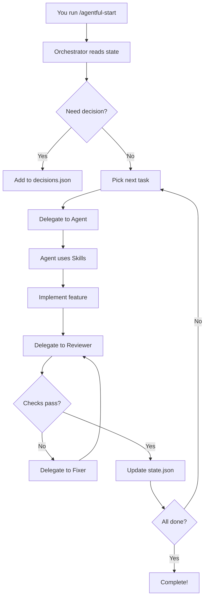

# Core Concepts Overview

Agentful represents a paradigm shift in software development - **autonomous product development powered by specialized AI agents**. Instead of writing code yourself, you coordinate a team of AI agents that build your product for you.

## The Core Philosophy

**Agentful is not a code generator.** It's an autonomous development system that:

- **Thinks before it acts** - Analyzes requirements, plans architecture, makes technical decisions
- **Works iteratively** - Builds, validates, fixes, and improves in continuous loops
- **Maintains quality** - Enforces type safety, testing, code review standards
- **Scales efficiently** - Uses the right agent for each task (backend, frontend, testing)
- **Respects your decisions** - Asks for input when needed, never guesses critical choices

## Why Agentful Exists

Traditional development has pain points:

| Pain Point | Traditional Approach | Agentful Approach |
|------------|---------------------|-------------------|
| **Boilerplate** | Write it yourself | Agents generate it automatically |
| **Testing** | Often skipped or incomplete | 80% coverage enforced |
| **Code Review** | Manual, inconsistent | Automated on every change |
| **Dead Code** | Accumulates over time | Detected and removed automatically |
| **Type Errors** | Found at runtime | Caught before validation passes |
| **Context Switching** | You do everything | Specialist agents handle their domains |
| **Progress Tracking** | Manual updates | Automatic state tracking |

## The Big Picture

Agentful orchestrates **seven specialized agents** that work together:

```
┌─────────────────────────────────────────────────────────────┐
│                     Orchestrator                            │
│              (Coordinates but never codes)                  │
└────────────┬────────────────────────────────────────────────┘
             │
             ├──► Architect ──► Analyzes tech stack, generates specialists
             │
             ├──► Backend ────► Services, repositories, APIs
             │
             ├──► Frontend ───► Components, pages, hooks, styling
             │
             ├──► Tester ─────► Unit, integration, E2E tests
             │
             ├──► Reviewer ───► Code quality, dead code detection
             │
             └──► Fixer ──────► Auto-fixes validation issues
```

## Core Concepts Deep Dive

Each core concept builds on this foundation:

### [Agents](./agents)
**Specialized AI workers** with distinct responsibilities, scopes, and patterns. The orchestrator delegates work to the right agent based on what needs to be done.

### [Orchestrator](./orchestrator)
The **conductor of the symphony** - reads state, picks tasks, delegates to specialists, validates work, and tracks progress. Never writes code directly.

### [Slash Commands](./slash-commands)
Your **control interface** for starting, monitoring, and steering autonomous development. Simple commands that trigger complex workflows.

### [Skills](./skills)
**Domain-specific capabilities** that can be added to agents to extend their functionality with specialized knowledge.

### [State Management](./state-management)
**Progress tracking** through JSON files that capture what's done, what's blocked, what's pending, and what decisions have been made.

## How These Concepts Connect



## The Development Loop

At its core, Agentful follows this loop:

1. **Read State** - Check what's done, what's blocked, what's next
2. **Pick Task** - Choose highest priority unblocked work
3. **Delegate** - Assign to specialist agent with clear instructions
4. **Validate** - Run all quality checks
5. **Fix** - Resolve any issues found
6. **Update** - Record progress in state files
7. **Repeat** - Until 100% complete

## Why This Architecture Matters

### Separation of Concerns
Each agent has a **single, well-defined responsibility**:
- Backend agent never touches UI code
- Frontend agent never modifies API routes
- Orchestrator never writes code directly

This prevents confusion and ensures expertise is applied where it matters most.

### Continuous Validation
Every change is **automatically validated** before being considered complete:
- Type errors caught immediately
- Tests required for coverage
- Dead code removed automatically
- Security scans on every change

### Human-in-the-Loop
When Agentful needs your input:
- Development continues on unblocked features
- Decisions are recorded with context
- You provide guidance, not implementation

### State as Truth Source
All progress tracked in **simple JSON files**:
- Easy to inspect
- Easy to version control
- Easy to debug when stuck

## What Makes Agentful Different

| Aspect | Code Generators | Agentful |
|--------|----------------|----------|
| **Output** | One-time code | Continuous development |
| **Quality** | Variable | Enforced gates |
| **Testing** | Maybe | 80% coverage required |
| **Iteration** | Manual | Automatic loops |
| **Context** | Single prompt | Full product spec |
| **Validation** | User checks | Automated |
| **Dead Code** | Accumulates | Auto-removed |

## Getting Started with Core Concepts

We recommend exploring these concepts in this order:

1. **[Agents](./agents)** - Understand your AI team
2. **[Orchestrator](./orchestrator)** - See how they're coordinated
3. **[Slash Commands](./slash-commands)** - Learn to control the system
4. **[State Management](./state-management)** - Track progress
5. **[Skills](./skills)** - Extend capabilities (optional)

Each concept page includes:
- **WHY** it exists before **HOW** it works
- Real examples from Agentful's codebase
- Cross-links to related concepts
- Practical use cases

## The Agentful Promise

When you use Agentful, you're not just getting code. You're getting:

- **Autonomous Development** - Build products while you sleep
- **Quality Assurance** - Multiple validation gates
- **Progress Tracking** - Always know what's done
- **Flexibility** - Intervene when needed, automate when possible
- **Scalability** - Add agents for new tech stacks
- **Transparency** - See what's happening and why

---

**Next:** [Learn about the Agent System](./agents)
