# What is agentful?

**agentful** is a local development toolkit that runs specialized agents in Claude Code.

**[Configure Your Installation →](/)**

## What You Get

When you run `npx @itz4blitz/agentful init`, you get:
- **8 specialized agents** - Files in `.claude/agents/` that give Claude Code specific instructions
- **Slash commands** - `/agentful-start`, `/agentful-status`, etc.
- **Product tracking** - `.agentful/` folder with state, progress, decisions
- **Protective hooks** - Prevents Claude from littering your codebase with random files

**This runs locally in Claude Code on your machine.**

## Core Capabilities

agentful provides four key capabilities that transform autonomous agent coordination:

### 1. Multi-Agent Orchestration

Eight specialized agents work together on your codebase:
- **Orchestrator** - Coordinates all work, delegates to specialists, never writes code directly
- **Architect** - Analyzes your tech stack and code patterns, generates domain-specific agents
- **Backend** - Implements server-side logic, APIs, database schemas, authentication
- **Frontend** - Builds UI components, pages, state management, client-side routing
- **Tester** - Writes unit, integration, and E2E tests targeting 80% coverage
- **Reviewer** - Validates code quality, finds dead code, runs security checks
- **Fixer** - Automatically fixes validation failures and test errors
- **Product Analyzer** - Analyzes product specs for gaps, ambiguities, and readiness

Each agent has explicit boundaries and knows when to delegate work outside their scope.

### 2. Automated Quality Gates

Six core quality gates validate every change before it's marked complete:
- **Type Checking** - Zero TypeScript/Flow errors
- **Linting** - ESLint, Biome, Ruff compliance
- **Tests** - All test suites passing
- **Coverage** - Minimum 80% code coverage
- **Security** - No vulnerable dependencies or hardcoded secrets
- **Dead Code** - No unused exports, files, or dependencies

Gates automatically adapt to your tech stack. When failures occur, the **Fixer** agent auto-remediates and re-validates.

### 3. Product-Driven Development

agentful works from structured product specifications:
- Hierarchical feature organization (domains → features → subtasks)
- Priority levels (CRITICAL, HIGH, MEDIUM, LOW)
- Acceptance criteria with checkboxes
- Progress tracking with completion percentages
- Automatic feature status updates

The orchestrator picks the highest-priority incomplete feature and works until 100% complete.

### 4. Tech Stack Intelligence

Automatically detects and adapts to your technology stack:
- **Languages**: TypeScript, JavaScript, Python, Go, Rust, Java, C#, PHP, Ruby, Elixir
- **Frameworks**: React, Next.js, Vue, Angular, Svelte, Express, NestJS, Django, Flask, FastAPI
- **Databases**: PostgreSQL, MySQL, SQLite, MongoDB, Redis
- **ORMs**: Prisma, Drizzle, TypeORM, Mongoose, SQLAlchemy
- **Testing**: Jest, Vitest, Playwright, Cypress, Pytest, JUnit

Generates domain-specific agents based on your actual code patterns, not generic templates.

## Agent Architecture

Claude Code runs with different instruction sets depending on which agent you invoke. Each agent has explicit scope boundaries and responsibilities:

### Core Agents

- **`@orchestrator`** - Coordinates work, delegates to specialists, never writes code directly
- **`@architect`** - Analyzes tech stack, generates domain-specific agents
- **`@backend`** - Server-side logic, APIs, databases
- **`@frontend`** - UI components, state management, client code
- **`@tester`** - Test generation and execution
- **`@reviewer`** - Quality validation, security checks
- **`@fixer`** - Automated remediation of failures

### Specialized Agents

Beyond core agents, agentful can generate domain-specific agents based on your codebase:

- **`@auth-agent`** - Authentication and authorization patterns
- **`@payment-agent`** - Payment processing and billing
- **`@notification-agent`** - Email, SMS, push notifications
- **Custom agents** - Generated from your business logic

Each agent knows when to delegate to others and when a task is outside their scope.

### Multi-Agent Distribution

The orchestrator acts as the central coordinator, analyzing tasks and delegating to specialist agents based on the work required:

<div className="mermaid-diagram">


</div>

**How it works:**
1. You invoke `/agentful-start` with a task
2. Orchestrator classifies the work type (feature, bugfix, refactor, etc.)
3. Delegates to appropriate specialist agents in parallel when possible
4. Agents complete their work and report back
5. Reviewer validates against quality gates
6. Fixer auto-remediates any failures
7. Progress is tracked and state is updated

## Development Workflow

The typical agentful workflow follows this pattern:

### 1. Define Product Specification

Create a structured product spec in `.claude/product/`:

```markdown
## Overview
Task management for distributed teams

## Tech Stack
- Next.js 15 + TypeScript
- Prisma + PostgreSQL
- Vitest + Playwright

## Features
1. Authentication (CRITICAL)
2. Project management (HIGH)
3. Task assignment (MEDIUM)
```

### 2. Generate Specialized Agents

Run `/agentful-generate` to analyze your codebase:

**For new projects** (no code yet):
- Prompts you to define tech stack and product requirements first
- Can use `/agentful-init` for guided setup
- Generates agents from product spec + best practices

**For existing projects**:
- Scans code to discover business domains and patterns
- Detects tech stack from package files and imports
- Generates domain-specific agents (e.g., `@auth`, `@billing`) based on actual code
- Creates tech skills (e.g., React patterns, Prisma patterns) from your conventions

### 3. Start Structured Development

Run `/agentful-start` to begin the autonomous work workflow:
- Orchestrator reads product specification
- Picks highest-priority incomplete feature
- Delegates to specialist agents
- Validates through quality gates
- Updates progress tracking
- Repeats until all features are 100% complete

### Workflow Pipeline

The workflow follows these stages with automatic progression:

<div className="mermaid-diagram">


</div>

### 4. Human Checkpoints

The system pauses for your input on:
- Architectural decisions
- Library selection
- Security configurations
- API design choices
- Database schema changes

You remain in control while Claude handles implementation details.

## Quality Gates

All implementations are validated against six automated quality gates before deployment.

### The 6 Gates

Every feature must pass all six gates:

```mermaid
%%{init: {'theme':'dark', 'themeVariables': { 'edgeLabelBackground':'transparent'}}}%%
graph LR
    Code["💻 Code"] --> G1["✓ Types"]
    G1 -->|✓| G2["📏 Lint"]
    G2 -->|✓| G3["🧪 Tests"]
    G3 -->|✓| G4["📊 Coverage"]
    G4 -->|✓| G5["🔒 Security"]
    G5 -->|✓| G6["🧹 Dead Code"]
    G6 -->|✓| Ship["🚀 Ship"]

    G1 -.->|✗| Fixer["🔧 Fixer"]
    G2 -.->|✗| Fixer
    G3 -.->|✗| Fixer
    G4 -.->|✗| Fixer
    G5 -.->|✗| Fixer
    G6 -.->|✗| Fixer
    Fixer -.-> G1

    style G1 fill:#3b82f6,stroke:#2563eb,color:#fff
    style G2 fill:#8b5cf6,stroke:#7c3aed,color:#fff
    style G3 fill:#10b981,stroke:#059669,color:#fff
    style G4 fill:#ec4899,stroke:#db2777,color:#fff
    style G5 fill:#ef4444,stroke:#dc2626,color:#fff
    style G6 fill:#f59e0b,stroke:#d97706,color:#fff
    style Ship fill:#22c55e,stroke:#16a34a,color:#fff
    style Fixer fill:#f97316,stroke:#ea580c,color:#fff

    linkStyle 1,2,3,4,5,6 stroke:#22c55e,stroke-width:3px,color:#22c55e
    linkStyle 7,8,9,10,11,12 stroke:#ef4444,stroke-width:2px,color:#ef4444
```

<div className="mermaid-diagram">



</div>

**Gate Details:**
- **Type Checking** - Zero TypeScript/Flow errors
- **Linting** - Code follows style guide (ESLint, Biome, Ruff)
- **Tests** - All test suites passing
- **Coverage** - Minimum 80% code coverage
- **Security** - No vulnerable dependencies
- **Dead Code** - No unused exports or files

Gates adapt to your stack. The framework detects available tools and runs appropriate checks. When gates fail, the **Fixer** agent automatically attempts remediation.

## How It All Works Together

agentful creates a complete autonomous agent system through several interconnected components:

### Installation & Setup

See the [Installation Guide](/getting-started/installation) for setup details.

### Agent Generation (`/agentful-generate`)

The **Architect** agent analyzes your project and generates specialized agents:

1. **Tech Stack Detection** - Reads package.json, imports, config files
2. **Domain Discovery** - Scans code structure to find business domains (auth, billing, etc.)
3. **Pattern Recognition** - Samples your actual code to learn conventions
4. **Agent Generation** - Creates domain agents (e.g., `@auth`, `@payments`) with context-specific instructions
5. **Skill Creation** - Generates tech skills (e.g., React patterns, Prisma patterns) from your code

Domain agents only generate if confidence >= 75% based on evidence (directories, API routes, services, models).

### Development Loop (`/agentful-start`)

The **Orchestrator** manages the complete development cycle:

1. **Read Product Spec** - Loads `.claude/product/index.md` and domain features
2. **Prioritize Work** - Picks highest-priority incomplete feature (CRITICAL > HIGH > MEDIUM > LOW)
3. **Classify Work Type** - Determines if this is a feature, bugfix, enhancement, or refactor
4. **Delegate to Specialists**:
   - Backend work → `@backend` agent
   - Frontend work → `@frontend` agent
   - Database changes → `@backend` agent
   - Testing → `@tester` agent
5. **Validate Quality** - `@reviewer` runs all 6 quality gates
6. **Auto-Fix Failures** - `@fixer` remediates any validation errors
7. **Update Progress** - Writes to `.agentful/completion.json`
8. **Handle Decisions** - Blocks on questions needing human input, adds to `decisions.json`
9. **Repeat** - Continues until all features are 100% complete

### Human Checkpoints

The orchestrator pauses for your input on:
- **Architectural decisions** - "Should we use REST or GraphQL?"
- **Library selection** - "Which auth library: NextAuth, Clerk, or custom?"
- **Security configs** - "What CORS policy should we use?"
- **Database schemas** - "Confirm this migration adds the right indexes"

You answer via `/agentful-decide`, and development continues.

### Progress Tracking

Real-time tracking through `.agentful/completion.json`:
```json
{
  "domains": {
    "authentication": {
      "status": "complete",
      "score": 100,
      "features": {
        "login": { "status": "complete", "score": 100 },
        "register": { "status": "in-progress", "score": 65 }
      }
    }
  },
  "overall_progress": 82
}
```

Run `/agentful-status` anytime to see visual progress breakdown.

## How It Works (Technical Details)

### File Structure

agentful creates a specific directory structure in your project:

```
your-project/
├── CLAUDE.md               # Project context
├── .claude/                # Framework (version control)
│   ├── agents/
│   │   ├── orchestrator.md
│   │   ├── backend.md
│   │   ├── frontend.md
│   │   ├── tester.md
│   │   └── ephemeral/      # Generated agents (gitignored)
│   ├── commands/
│   │   ├── agentful-start.md
│   │   ├── agentful-status.md
│   │   └── agentful-validate.md
│   ├── skills/
│   │   ├── product-tracking/
│   │   └── validation/
│   ├── product/            # Product specification
│   │   ├── index.md
│   │   └── domains/
│   └── settings.json
└── .agentful/              # Runtime state (gitignored)
    ├── state.json
    ├── completion.json
    └── decisions.json
```

**Version Control**: `.claude/` and `CLAUDE.md`
**Gitignore**: `.agentful/` and `.claude/agents/ephemeral/`

### Tech Stack Detection

agentful automatically detects and adapts to your technology stack:

- **Languages**: TypeScript, JavaScript, Python, Go, Rust, Java, C#, PHP, Ruby, Elixir
- **Frontend**: React, Vue, Angular, Svelte, Next.js, Astro, SolidJS
- **Backend**: Express, Fastify, NestJS, Hono, Next.js API Routes
- **Databases**: PostgreSQL, MySQL, SQLite, MongoDB
- **ORMs**: Prisma, Drizzle, TypeORM, Mongoose
- **Testing**: Jest, Vitest, Playwright, Cypress, Pytest, JUnit

The system generates appropriate patterns and validations based on what it detects.

## New vs Existing Projects

### New Projects (No Code Yet)

1. Architect prompts for tech stack choices
2. Generates template agents from best practices
3. Implements first feature
4. Re-analyzes actual code
5. Updates agents with your specific patterns
6. Continues with refined agents

The system learns from your actual code and refines its approach.

### Existing Projects (With Code)

1. Architect samples your codebase
2. Detects patterns, conventions, and structure
3. Generates agents matching your exact style
4. Begins implementation following existing patterns

agentful adapts to your existing code rather than imposing new patterns.

## Extended Development Sessions

Use the Ralph Wiggum plugin for extended sessions:

```bash
claude
/plugin install ralph-wiggum@anthropics
/ralph-loop "/agentful-start" --max-iterations 50
```

This runs multiple development iterations until the max is reached or the orchestrator completes its work.

## What agentful Is Not

Important limitations to understand:

- **Not fully autonomous** - Requires human decisions on architecture and design
- **Not a testing framework** - Generates tests but needs infrastructure
- **Not a deployment system** - Focused on development, not operations
- **Not a replacement for developers** - Accelerates implementation, not strategy

Works best with:
- Clear product specifications
- Timely human decisions
- Existing project structure (or willingness to define one)

## Common Workflows

For step-by-step usage instructions, see the [Quick Start Guide](/getting-started/quick-start) or [First Project Tutorial](/getting-started/first-project).

## Next Steps

Now that you understand how agentful works:

1. **[Configure Your Installation](/)** - Use the interactive configurator
2. **[Quick Start Guide](/getting-started/quick-start)** - Get up and running in 5 minutes
3. **[Your First Project](/getting-started/first-project)** - Step-by-step tutorial
4. **[Agent Details](/agents)** - Deep dive into each agent
5. **[Command Reference](/commands)** - All available commands

## Resources

- **GitHub**: [github.com/itz4blitz/agentful](https://github.com/itz4blitz/agentful)
- **Documentation**: [agentful.app](https://agentful.app)
- **Issues**: [github.com/itz4blitz/agentful/issues](https://github.com/itz4blitz/agentful/issues)
- **Community**: [Discord](https://discord.gg/SMDvJXUe)

---

Built on [Claude Code](https://www.claude.com/product/claude-code) by Anthropic.
