import { DiagramModal } from '../../components/DiagramModal'

# What is agentful?

**agentful** is a Claude Code configuration that adds specialized agents, quality gates, and structured workflows to your development process. It transforms how you build software by providing autonomous development capabilities while keeping you in control of key decisions.

**[Configure Your Installation →](/)**

## Core Capabilities

agentful extends Claude Code with four key capabilities:

1. **Specialized Agents** - Backend, frontend, testing, review, orchestration
2. **Quality Gates** - Type checking, linting, test coverage, dead code detection
3. **Product Tracking** - Feature status, completion percentage, blocking decisions
4. **Smart Analysis** - Tech stack detection, pattern recognition, domain discovery

It's a `.claude/` directory structure with agents, commands, and skills that Claude Code loads automatically.

## Agent Architecture

Claude Code runs with different instruction sets depending on which agent you invoke. Each agent has explicit scope boundaries and responsibilities:

### Core Agents

- **`@orchestrator`** - Coordinates work, delegates to specialists, never writes code directly
- **`@architect`** - Analyzes tech stack, generates domain-specific agents
- **`@backend`** - Server-side logic, APIs, databases
- **`@frontend`** - UI components, state management, client code
- **`@tester`** - Test generation and execution
- **`@reviewer`** - Quality validation, security checks
- **`@fixer`** - Automated remediation of failures

### Specialized Agents

Beyond core agents, agentful can generate domain-specific agents based on your codebase:

- **`@auth-agent`** - Authentication and authorization patterns
- **`@payment-agent`** - Payment processing and billing
- **`@notification-agent`** - Email, SMS, push notifications
- **Custom agents** - Generated from your business logic

Each agent knows when to delegate to others and when a task is outside their scope.

### Multi-Agent Distribution

The orchestrator acts as the central coordinator, analyzing tasks and delegating to specialist agents based on the work required:

```mermaid
graph TD
    User[👤 Developer] -->|/agentful-start| Orchestrator[🎯 Orchestrator<br/>Coordinates & Delegates]

    Orchestrator -->|Analyze| Architect[🏗️ Architect<br/>Tech Stack Detection]
    Orchestrator -->|APIs| Backend[⚙️ Backend<br/>Server Logic]
    Orchestrator -->|UI| Frontend[🎨 Frontend<br/>Components & State]
    Orchestrator -->|Tests| Tester[🧪 Tester<br/>80% Coverage]
    Orchestrator -->|Validate| Reviewer[✅ Reviewer<br/>6 Quality Gates]

    Architect -->|Generates| Domain[📦 Domain Agents<br/>Auth, Payment, etc]

    Backend -.-> Orchestrator
    Frontend -.-> Orchestrator
    Tester -.-> Orchestrator

    Reviewer -->|Pass| Orchestrator
    Reviewer --> Fixer[🔧 Fixer<br/>Auto-remediation]
    Fixer -.-> Reviewer

    Orchestrator --> Progress[📊 Progress Tracking<br/>completion.json]
    Orchestrator --> Decisions[⚠️ Pending Decisions<br/>decisions.json]

    style Orchestrator fill:#5e6ad2,stroke:#4c5ab8,color:#fff
    style Backend fill:#6366f1,stroke:#4f46e5,color:#fff
    style Frontend fill:#8b5cf6,stroke:#7c3aed,color:#fff
    style Tester fill:#ec4899,stroke:#db2777,color:#fff
    style Reviewer fill:#10b981,stroke:#059669,color:#fff
    style Fixer fill:#f59e0b,stroke:#d97706,color:#fff
    style Architect fill:#14b8a6,stroke:#0d9488,color:#fff
    style Domain fill:#06b6d4,stroke:#0891b2,color:#fff
    style Progress fill:#22c55e,stroke:#16a34a,color:#fff
    style Decisions fill:#ef4444,stroke:#dc2626,color:#fff
```

<DiagramModal title="Multi-Agent Distribution">



</DiagramModal>

**How it works:**
1. You invoke `/agentful-start` with a task
2. Orchestrator classifies the work type (feature, bugfix, refactor, etc.)
3. Delegates to appropriate specialist agents in parallel when possible
4. Agents complete their work and report back
5. Reviewer validates against quality gates
6. Fixer auto-remediates any failures
7. Progress is tracked and state is updated

## Development Workflow

The typical agentful workflow follows this pattern:

### 1. Define Product Specification

Create a structured product spec in `.claude/product/`:

```markdown
## Overview
Task management for distributed teams

## Tech Stack
- Next.js 14 + TypeScript
- Prisma + PostgreSQL
- Vitest + Playwright

## Features
1. Authentication (CRITICAL)
2. Project management (HIGH)
3. Task assignment (MEDIUM)
```

### 2. Detect Tech Stack & Generate Agents

agentful automatically detects your tech stack and generates:
- Domain-specific agents based on your business logic
- Tech stack skills for framework patterns
- Pattern-matched instructions from your actual code

### 3. Start Structured Development

Run `/agentful-start` to begin the automated development workflow.

### Workflow Pipeline

The workflow follows these stages with automatic progression:

```mermaid
graph LR
    A[📝 Product Spec] -->|Analyze| B[🔍 Requirements Check]
    B -->|Complete| C[💻 Implementation]
    B -->|Gaps found| D[❓ Ask Human]
    D --> C

    C -->|Backend| E1[⚙️ API Development]
    C -->|Frontend| E2[🎨 UI Development]
    C -->|Database| E3[🗄️ Schema Changes]

    E1 --> F[🧪 Test Generation]
    E2 --> F
    E3 --> F

    F -->|Generate| G[📊 80% Coverage]
    G --> H{✅ Quality Gates}

    H -->|Pass| I[🚀 Complete]
    H -->|Fail| J[🔧 Auto-Fix]
    J --> H

    I --> K[📈 Update Progress]
    K --> L{More Features?}
    L -->|Yes| C
    L -->|No| M[✨ Done]

    style A fill:#3b82f6,stroke:#2563eb,color:#fff
    style B fill:#8b5cf6,stroke:#7c3aed,color:#fff
    style C fill:#6366f1,stroke:#4f46e5,color:#fff
    style F fill:#ec4899,stroke:#db2777,color:#fff
    style H fill:#10b981,stroke:#059669,color:#fff
    style I fill:#22c55e,stroke:#16a34a,color:#fff
    style J fill:#f59e0b,stroke:#d97706,color:#fff
    style M fill:#22c55e,stroke:#16a34a,color:#fff
    style D fill:#ef4444,stroke:#dc2626,color:#fff
```

<DiagramModal title="Development Workflow Pipeline">



</DiagramModal>

### 4. Human Checkpoints

The system pauses for your input on:
- Architectural decisions
- Library selection
- Security configurations
- API design choices
- Database schema changes

You remain in control while Claude handles implementation details.

## Quality Gates

All implementations are validated against six automated quality gates before deployment.

### The 6 Gates

Every feature must pass all six gates:

```mermaid
graph TB
    subgraph Quality Gates
        G1[🔷 Type Checking<br/>Zero TS/Flow errors]
        G2[📏 Linting<br/>Style guide compliance]
        G3[✅ Tests<br/>All suites passing]
        G4[📊 Coverage<br/>Minimum 80%]
        G5[🔒 Security<br/>No vulnerabilities]
        G6[🗑️ Dead Code<br/>No unused exports]
    end

    Code[📝 Your Code] --> G1
    G1 -->|Pass| G2
    G2 -->|Pass| G3
    G3 -->|Pass| G4
    G4 -->|Pass| G5
    G5 -->|Pass| G6
    G6 -->|Pass| Ship[🚀 Ship It!]

    G1 -->|Fail| Fixer[🔧 Auto-Fix]
    G2 -->|Fail| Fixer
    G3 -->|Fail| Fixer
    G4 -->|Fail| Fixer
    G5 -->|Fail| Fixer
    G6 -->|Fail| Fixer

    Fixer --> G1

    style G1 fill:#3b82f6,stroke:#2563eb,color:#fff
    style G2 fill:#8b5cf6,stroke:#7c3aed,color:#fff
    style G3 fill:#10b981,stroke:#059669,color:#fff
    style G4 fill:#ec4899,stroke:#db2777,color:#fff
    style G5 fill:#ef4444,stroke:#dc2626,color:#fff
    style G6 fill:#f59e0b,stroke:#d97706,color:#fff
    style Ship fill:#22c55e,stroke:#16a34a,color:#fff
    style Fixer fill:#f97316,stroke:#ea580c,color:#fff
```

<DiagramModal title="Quality Gates Validation Flow">



</DiagramModal>

**Gate Details:**
- **Type Checking** - Zero TypeScript/Flow errors
- **Linting** - Code follows style guide (ESLint, Biome, Ruff)
- **Tests** - All test suites passing
- **Coverage** - Minimum 80% code coverage
- **Security** - No vulnerable dependencies
- **Dead Code** - No unused exports or files

Gates adapt to your stack. The framework detects available tools and runs appropriate checks. When gates fail, the **Fixer** agent automatically attempts remediation.

## How It Works

### File Structure

agentful creates a specific directory structure in your project:

```
your-project/
├── CLAUDE.md               # Project context
├── .claude/                # Framework (version control)
│   ├── agents/
│   │   ├── orchestrator.md
│   │   ├── backend.md
│   │   ├── frontend.md
│   │   ├── tester.md
│   │   └── ephemeral/      # Generated agents (gitignored)
│   ├── commands/
│   │   ├── agentful-start.md
│   │   ├── agentful-status.md
│   │   └── agentful-validate.md
│   ├── skills/
│   │   ├── product-tracking/
│   │   └── validation/
│   ├── product/            # Product specification
│   │   ├── index.md
│   │   └── domains/
│   └── settings.json
└── .agentful/              # Runtime state (gitignored)
    ├── state.json
    ├── completion.json
    └── decisions.json
```

**Version Control**: `.claude/` and `CLAUDE.md`
**Gitignore**: `.agentful/` and `.claude/agents/ephemeral/`

### Tech Stack Detection

agentful automatically detects and adapts to your technology stack:

- **Languages**: TypeScript, JavaScript, Python, Go, Rust, Java, C#, PHP, Ruby, Elixir
- **Frontend**: React, Vue, Angular, Svelte, Next.js, Astro, SolidJS
- **Backend**: Express, Fastify, NestJS, Hono, Next.js API Routes
- **Databases**: PostgreSQL, MySQL, SQLite, MongoDB
- **ORMs**: Prisma, Drizzle, TypeORM, Mongoose
- **Testing**: Jest, Vitest, Playwright, Cypress, Pytest, JUnit

The system generates appropriate patterns and validations based on what it detects.

## New vs Existing Projects

### New Projects (No Code Yet)

1. Architect prompts for tech stack choices
2. Generates template agents from best practices
3. Implements first feature
4. Re-analyzes actual code
5. Updates agents with your specific patterns
6. Continues with refined agents

The system learns from your actual code and refines its approach.

### Existing Projects (With Code)

1. Architect samples your codebase
2. Detects patterns, conventions, and structure
3. Generates agents matching your exact style
4. Begins implementation following existing patterns

agentful adapts to your existing code rather than imposing new patterns.

## Extended Development Sessions

Use the Ralph Wiggum plugin for extended sessions:

```bash
claude
/plugin install ralph-wiggum@anthropics
/ralph-loop "/agentful-start" --max-iterations 50
```

This runs multiple development iterations until the max is reached or the orchestrator completes its work.

## What agentful Is Not

Important limitations to understand:

- **Not fully autonomous** - Requires human decisions on architecture and design
- **Not a testing framework** - Generates tests but needs infrastructure
- **Not a deployment system** - Focused on development, not operations
- **Not a replacement for developers** - Accelerates implementation, not strategy

Works best with:
- Clear product specifications
- Timely human decisions
- Existing project structure (or willingness to define one)

## Common Workflows

### New Project from Scratch

```bash
npx @itz4blitz/agentful init
claude
/agentful-product          # Interactive spec creation
/agentful-start            # Begin development (auto-detects tech stack)
/agentful-status           # Check progress
/agentful-decide           # Answer blocking decisions
```

### Existing Codebase

```bash
npx @itz4blitz/agentful init
claude
/agentful-product          # Reverse-engineer spec
/agentful-start            # Continue development (auto-detects tech stack)
```

### Ad-hoc Questions

```bash
claude
/agentful "Should I use REST or GraphQL for this API?"
```

## Next Steps

Now that you understand how agentful works:

1. **[Configure Your Installation](/)** - Use the interactive configurator
2. **[Quick Start Guide](/getting-started/quick-start)** - Get up and running in 5 minutes
3. **[Your First Project](/getting-started/first-project)** - Step-by-step tutorial
4. **[Agent Details](/agents)** - Deep dive into each agent
5. **[Command Reference](/commands)** - All available commands

## Resources

- **GitHub**: [github.com/itz4blitz/agentful](https://github.com/itz4blitz/agentful)
- **Documentation**: [agentful.app](https://agentful.app)
- **Issues**: [github.com/itz4blitz/agentful/issues](https://github.com/itz4blitz/agentful/issues)
- **Community**: [Discord](https://discord.gg/SMDvJXUe)

---

Built on [Claude Code](https://code.anthropic.com) by Anthropic.
