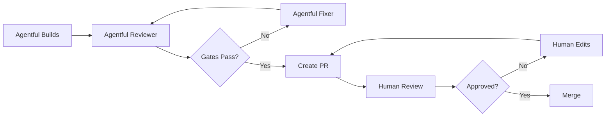

# Team Adoption Guide

Using Agentful in a team environment requires coordination, shared standards, and clear workflows. This guide shows you how to adopt Agentful across your team effectively.

---

## Challenges of Team Adoption

When using Agentful solo, you can make decisions on the fly. In a team, you need:

- **Consistent PRODUCT.md standards** - Everyone writes specs the same way
- **Shared configuration** - Same agents, commands, and settings across team
- **Collaboration workflows** - How to work together without conflicts
- **Decision handling** - How to resolve team decisions Agentful needs
- **Code review integration** - Agentful + human review process

---

## Setup Phase: Team Configuration

### Step 1: Initialize Team Repo

Create a shared repository with Agentful:

```bash
# Team repo initialization
mkdir myteam-agentful-config
cd myteam-agentful-config
npx agentful init

# Customize for your team's standards
# Edit .claude/agents/ to match your patterns
# Edit .claude/commands/ to add team-specific workflows
```

**Commit to version control**:
```bash
git add .claude/
git commit -m "Add team Agentful configuration"
git push origin main
```

### Step 2: Customize Agents for Team Patterns

**Example: Backend agent with team patterns**

Edit `.claude/agents/backend.md`:

```markdown
# Team Backend Agent

You are the Backend Agent for [Company Name].

## Team Patterns

### API Response Format
All API routes must return:
```typescript
{
  data: T | null,
  error: {
    code: string,
    message: string,
    details?: any
  } | null
}
```

### Error Handling
- Use `AppError` class from `src/lib/errors.ts`
- Log all errors to `src/lib/logger.ts`
- Never expose stack traces to clients

### Database Queries
- Use Prisma transactions for multi-step operations
- Always use `try/finally` to ensure connections close
- Add `@prisma/client` types for all query results

## Team-Specific Rules

- Follow existing folder structure in `src/app/api/`
- Match existing route patterns: `/api/v1/resource/[id]/action`
- Use Zod schemas from `src/lib/schemas/` for validation
- Add JSDoc comments to all exported functions
```

**Why this matters**: Agentful follows your team's established patterns instead of guessing.

---

### Step 3: Create Team PRODUCT.md Template

Create `.claude/templates/PRODUCT.md`:

```markdown
# [Company Name] Product Specification Template

## Overview
[2-3 sentence description]

## Tech Stack

### Frontend
- **Framework**: Next.js 14 (App Router)
- **Language**: TypeScript (strict mode)
- **Styling**: Tailwind CSS
- **State**: Zustand
- **Forms**: React Hook Form + Zod

### Backend
- **Runtime**: Node.js
- **Framework**: Next.js API Routes
- **Language**: TypeScript (strict mode)

### Database
- **Database**: PostgreSQL
- **ORM**: Prisma

### Authentication
- **Method**: JWT with httpOnly cookies
- **Implementation**: `src/lib/auth.ts`

### Testing
- **Unit**: Vitest
- **E2E**: Playwright

### Deployment
- **Hosting**: Vercel
- **CI/CD**: GitHub Actions

## Features

### 1. [Feature Name] - [PRIORITY]
**Description**: [One sentence]

**Acceptance Criteria**:
- [ ] [Specific requirement]
- [ ] [Specific requirement]

**Technical Notes**:
- [Follow existing pattern in src/features/...]
```

**Teams can copy this template** for each new project, ensuring consistency.

---

### Step 4: Add Team-Specific Commands

Create `.claude/commands/team-deploy.md`:

```markdown
---
name: team-deploy
description: Deploy with team approval process
---

# Team Deploy Command

## Pre-Deploy Checklist

Run these checks before deploying:

1. **Validation**:
```bash
/agentful-validate
```

2. **Team Review**:
- Create PR with `agent-deploy` label
- Get approval from Tech Lead
- Ensure all CI checks pass

3. **Staging Test**:
- Deploy to staging environment
- Run E2E tests on staging
- Manual smoke test

## Deploy Process

If all checks pass:

```bash
# Deploy to production
npm run deploy:prod
```

## Post-Deploy

- [ ] Monitor error logs for 15 minutes
- [ ] Verify key user flows work
- [ ] Update team in #deployments channel
```

**Benefit**: Standardizes deployment process across team.

---

### Step 5: Document Team Conventions

Create `CONVENTIONS.md` in your repo:

```markdown
# Agentful Team Conventions

## PRODUCT.md Standards

### Priority Levels
- **CRITICAL**: Launch blockers, security, data integrity
- **HIGH**: Important features, can ship 1-2 days later
- **MEDIUM**: Nice to have, Polish
- **LOW**: Future improvements, optimizations

### Acceptance Criteria Format
All acceptance criteria must:
- Start with a verb ("Display", "Validate", "Handle")
- Be testable (can write a test for it)
- Be specific (no "good performance", use "< 200ms")

### Required Sections
Every feature must have:
- Description (one sentence)
- Acceptance criteria (checkbox list)
- User stories (for complex features)
- Technical notes (if integrating with existing systems)

## Code Standards

### File Naming
- Components: PascalCase (UserProfile.tsx)
- Utilities: camelCase (formatDate.ts)
- Hooks: camelCase with 'use' prefix (useAuth.ts)
- Types: PascalCase with 'Type' suffix (UserType)

### Import Order
```typescript
// 1. React
import { useState } from 'react';

// 2. Third-party
import { z } from 'zod';

// 3. Internal
import { Button } from '@/components/ui/button';
import { useAuth } from '@/hooks/useAuth';
```

## Git Workflow

### Branch Naming
- `feature/agentful-[feature-name]` - Features Agentful builds
- `fix/agentful-[issue]` - Agentful fixes
- `refactor/agentful-[area]` - Agentful refactors

### Commit Messages
When Agentful makes commits:
```
feat(agentful): implement user authentication

Agentful-built feature:
- Login form with email/password
- JWT token generation
- Protected routes
- Unit tests (82% coverage)

Generated by Agentful orchestrator
```

## Review Process

### Agentful-Generated PRs
1. **Auto-label**: Add `agent-generated` label
2. **Auto-assign**: Assign to team lead for review
3. **Checklist**:
   - [ ] Tests pass locally
   - [ ] No type errors (adapts to stack)
   - [ ] Security review (if auth/data)
   - [ ] Performance review (if API/DB)
   - [ ] UX review (if frontend)
4. **Approval**: Requires 1 approval + CI pass

### Human Edits to Agentful Code
If you modify Agentful-generated code:
1. Add comment: `// Human-modified: [reason]`
2. Update tests to match
3. Run `/agentful-validate` to ensure gates pass

## Decision Handling

### Team Decisions
When Agentful needs input, team decides in #agentful channel:

```markdown
@team Agentful needs decision:

Feature: User notifications
Question: Should we use WebSocket or polling?

Options:
1. WebSocket (real-time, more complex)
2. Polling every 30s (simpler, slight delay)
3. Server-Sent Events (middle ground)

Context: Building notification system for PRODUCT.md

React with :one: :two: or :three:
```

### Decision Documentation
After deciding, add to `.agentful/decisions.json`:
```json
{
  "id": "decision-001",
  "question": "WebSocket vs polling for notifications?",
  "answer": "Option 1: WebSocket",
  "reason": "Real-time is critical for collaboration features",
  "decidedBy": "team",
  "timestamp": "2026-01-18T10:00:00Z"
}
```

## Collaboration Rules

### Working on Same Project
1. **Coordinate in #agentful channel** before running `/agentful-start`
2. **Feature ownership**: Claim features before Agentful starts
3. **Staggered runs**: Don't run Agentful simultaneously on same project
4. **Sync frequently**: Push state changes regularly

### Code Conflicts
If you edit code Agentful is working on:
1. **Stop Agentful**: Let current task complete
2. **Resolve manually**: Fix conflicts yourself
3. **Validate**: Run `/agentful-validate`
4. **Resume**: `/agentful-start` continues

### State File Sharing
```bash
# Always pull latest state before starting Agentful
git pull origin main

# Push state after Agentful completes features
git add .agentful/
git commit -m "Update Agentful state"
git push origin main
```

## Quality Standards

### Before Marking Feature Complete
- [ ] All acceptance criteria pass
- [ ] Tests written and passing
- [ ] No type errors (adapts to stack)
- [ ] No console.log or debug statements
- [ ] Code follows team conventions
- [ ] Documentation updated (if needed)

### Code Review for Agentful Code
Review like human-written code:
- Is it maintainable?
- Is it performant?
- Is it secure?
- Does it follow patterns?
- Are tests sufficient?

## Onboarding New Team Members

### Learning Path

**Step 1: Observe**
- Watch Agentful build a simple feature
- Review generated code with mentor
- Understand PRODUCT.md format

**Step 2: Practice**
- Write PRODUCT.md for small feature with mentor
- Run `/agentful-start` with guidance
- Review code together

**Step 3: Independent**
- Write PRODUCT.md independently
- Run Agentful solo
- Team review of first solo project

**Step 4: Proficient**
- Handle complex features
- Mentor new team members
- Contribute to team config improvements

### Example: First Feature

**Junior developer's first Agentful feature:**

```bash
# 1. Clone project and setup
git clone team-repo
cd team-repo
npx agentful init  # If not already initialized

# 2. Study existing code
cat PRODUCT.md
/agentful-status  # See what's being worked on

# 3. Ask for a simple feature
"Mentor: What simple feature should I start with?"
"Try adding user profile editing"

# 4. Write PRODUCT.md addition
## Features

### 4. User Profile Editing - MEDIUM
**Description**: Users can edit their profile

**Acceptance Criteria**:
- [ ] Edit display name
- [ ] Upload avatar
- [ ] Save changes

# 5. Run Agentful
/agentful-start

# 6. Watch it build
# Agentful generates tests, implements feature, validates

# 7. Review with mentor
# Get feedback, learn patterns
```

**Benefit**: New team members learn by doing, with gradual responsibility.

---

## Collaboration Workflows

### Workflow 1: Feature Branch Development

**Pattern**: Each feature in its own branch

```bash
# 1. Create feature branch
git checkout -b feature/agentful-user-auth

# 2. Write/update PRODUCT.md
# Add authentication feature details

# 3. Run Agentful
claude
/agentful-start

# 4. Agentful builds feature, commits to branch

# 5. Human review
git push origin feature/agentful-user-auth
# Create PR, team reviews

# 6. Merge to main
git checkout main
git merge feature/agentful-user-auth
```

**Pros**:
- Isolated development
- Easy to review
- Can run multiple features in parallel

**Cons**:
- Merge conflicts if branches touch same files
- More Git overhead

---

### Workflow 2: Main Branch Development

**Pattern**: Direct development on main branch

```bash
# 1. Pull latest
git checkout main
git pull origin main

# 2. Update PRODUCT.md
# Add next feature to build

# 3. Run Agentful
claude
/agentful-start

# 4. Agentful builds, commits directly to main

# 5. Team reviews via PR after completion
git push origin main
# Create PR from main to main (for review)
# Merge after approval
```

**Pros**:
- Simpler Git workflow
- Fewer merge conflicts
- Continuous delivery style

**Cons**:
- Harder to work in parallel
- Main branch can be unstable

**Best for**: Small teams, rapid prototyping

---

### Workflow 3: Distributed Feature Development

**Pattern**: Team members claim features, develop in parallel

```markdown
In #agentful channel:

@alice Claiming "user authentication" feature
@bob Claiming "project management" feature
@carol Claiming "task CRUD" feature

[Each creates their branch]
alice: git checkout -b feature/auth
bob: git checkout -b feature/projects
carol: git checkout -b feature/tasks

[Each runs Agentful on their feature branch]
[Each creates PR when done]

[Team reviews and merges in priority order]
```

**Pros**:
- Parallel development
- Clear ownership
- Faster overall completion

**Cons**:
- Coordination overhead
- Possible overlapping work

**Best for**: Large teams, many features

---

## Decision Making at Scale

### Async Decision Process

**When Agentful needs input:**

1. **Agentful adds to decisions.json**:
```json
{
  "id": "decision-007",
  "question": "Should email notifications use queue or send immediately?",
  "context": "Building notification system, expect 1000 emails/hour at peak",
  "blocking": ["email-notifications"],
  "options": [
    "Queue with Redis (reliable, more complex)",
    "Send immediately (simpler, may block)",
    "Third-party service (SendGrid, reliable, cost)"
  ]
}
```

2. **Automated Slack notification**:
```javascript
// .claude/skills/slack-notifier/SKILL.md
// When decision.json changes, post to #agentful
{
  "text": "Decision needed from Agentful",
  "attachments": [{
    "title": "Email notification strategy",
    "text": "Context: Building notification system...",
    "actions": [
      { "text": "Queue", "value": "option-1" },
      { "text": "Immediate", "value": "option-2" },
      { "text": "SendGrid", "value": "option-3" }
    ]
  }]
}
```

3. **Team votes in thread**

4. **Majority wins**, update decisions.json:
```bash
/agentful-decide
# Agentful reads updated decisions.json, resumes work
```

**Benefit**: Team doesn't block Agentful. Decisions happen async.

---

### Decision Escalation Path

**Level 1: Individual Developer**
- Developer decides immediately
- Document in decisions.json
- No team review needed

**Level 2: Team Consensus**
- Post in #agentful channel
- 15-minute discussion
- Majority vote wins

**Level 3: Tech Lead**
- Controversial or high-impact decisions
- Tech lead makes final call
- Document reasoning

**Level 4: Product Manager**
- Product strategy decisions
- PM decides with tech input
- Affects roadmap and priorities

**Level 5: CTO/Architecture**
- Fundamental architecture changes
- Security-critical decisions
- Long-term tech stack implications

---

## Code Review Integration

### Hybrid Review Process

**Agentful generates code** → **Automated checks** → **Human review** → **Merge**



### Review Checklist for Agentful Code

**Automated (Agentful Reviewer)**:
- ✅ All tests passing
- ✅ No type errors (adapts to stack)
- ✅ 80%+ coverage
- ✅ No dead code
- ✅ No security issues

**Human (Team Reviewer)**:
- ✅ Follows team conventions
- ✅ Maintainable and readable
- ✅ Performance acceptable
- ✅ Error handling complete
- ✅ Accessibility considered
- ✅ Documentation adequate

### Review Acceleration Tips

**For faster reviews:**

1. **Small PRs**: Agentful should complete features before creating PRs, not mid-feature
2. **Clear descriptions**: PR description should link to PRODUCT.md feature
3. **Automated labels**: Apply labels based on feature type (`auth`, `ui`, `api`)
4. **Assign reviewers**: Auto-assign based on file ownership
5. **Template PR descriptions**:
```markdown
## Agentful-Generated PR

**Feature**: User Authentication (PRODUCT.md #1)
**Agent**: orchestrator + backend + frontend + tester
**Commit Hash**: abc123

### What was built
- Login form with email/password
- JWT authentication service
- Protected API routes
- Unit and integration tests

### Validation Results
- ✅ Tests: 47 passing
- ✅ TypeScript: 0 errors
- ✅ Coverage: 84%
- ✅ Dead code: 0 issues
- ✅ Security: 0 vulnerabilities

### Files changed
- `src/app/api/auth/login/route.ts` (new)
- `src/components/auth/LoginForm.tsx` (new)
- `src/lib/auth/jwt.ts` (new)
- `src/lib/auth/__tests__/jwt.test.ts` (new)

### Checklist
- [ ] Follows team conventions
- [ ] Performance acceptable
- [ ] Error handling complete
- [ ] Ready to merge

**Link to acceptance criteria**: [PRODUCT.md#1](../../PRODUCT.md#L50)
```

---

## Conflict Resolution

### Scenario 1: Human Edits Conflict with Agentful

**Situation**: You manually edit code, Agentful changes same file later.

**Resolution**:
```bash
# 1. Stop Agentful
# Let current task complete

# 2. Review conflicts
git diff
# Identify what Agentful changed vs your changes

# 3. Decide which to keep
# Usually: Keep human edits, let Agentful adapt

# 4. Document human override
// Human-modified: [reason] - [date] - [author]
// Original Agentful logic was: [description]

# 5. Re-validate
/agentful-validate

# 6. Resume Agentful
/agentful-start
# Agentful will adapt to your changes
```

**Prevention**:
- Coordinate in #agentful before editing Agentful code
- Edit different files than Agentful is working on
- Use branches to isolate changes

---

### Scenario 2: Multiple Team Members Running Agentful

**Situation**: Two team members run `/agentful-start` on same project simultaneously.

**Symptoms**:
- Conflicting commits
- Race conditions in state.json
- Overwriting each other's work

**Resolution**:

**Short term**:
```bash
# 1. Both stop Agentful
# 2. Decide who continues based on:
#    - Who started first
#    - Who has more critical feature
#    - Rock-paper-scissors if tied

# 3. Other person pulls changes:
git pull origin main
git checkout -b feature/their-feature
# Move their PRODUCT.md edits to this branch

# 4. Winner continues:
/agentful-start
```

**Long term**: Create coordination system:
```bash
# .claude/skills/coord-lock/SKILL.md
# Before starting, check if locked

if [ -f .agentful/.lock ]; then
  echo "Agentful already running by $(cat .agentful/.lock)"
  echo "Contact them to coordinate"
  exit 1
fi

# Create lock
echo "$(whoami)@$(hostname) on $(date)" > .agentful/.lock

# Release lock when done
trap "rm -f .agentful/.lock" EXIT
```

---

### Scenario 3: Disagreement on Implementation

**Situation**: Agentful builds feature one way, team thinks it should be different.

**Example**: Agentful uses React Query, team prefers Redux.

**Resolution**:

**Option 1: Let Agentful decide**
- If no strong preference, let Agentful continue
- Document team learns new pattern
- Evaluate after feature complete

**Option 2: Override via Technical Notes**
```markdown
**Technical Notes**:
- Use Redux Toolkit for state management (team standard)
- Follow existing pattern in src/store/
- Do NOT use React Query
```

**Option 3: Build and refactor**
- Let Agentful complete with its approach
- Team reviews and decides
- If refactor needed, add to next sprint
- Update technical notes for future

**Key**: Decide **before** Agentful builds, not after.

---

## Monitoring and Observability

Agentful provides built-in progress tracking and monitoring:

### Check Progress Anytime

Each team member can check project status:

```bash
/agentful-status
```

Output shows:
- Current task being worked on
- Overall progress percentage
- Quality gate status
- Pending decisions that need attention

### Example Output

```
🔧 Working on: User authentication feature
   Phase: implementation
   Iterations: 12

Progress:
   ████████░░░░░░░░░░░ 40%

Quality Gates:
   ✅ Tests Passing
   ✅ No Type Errors
   ✅ Coverage 80%
   ✅ No Dead Code
   ✅ Security Clean

⚠️  2 pending decisions:
   1. Which auth library to use?
   2. Session duration?
```

### What Gets Tracked Automatically

- **Progress**: `.agentful/completion.json` - feature completion % per feature
- **State**: `.agentful/state.json` - current task, phase, iterations
- **Decisions**: `.agentful/decisions.json` - pending/resolved decisions
- **Architecture**: `.agentful/architecture.json` - detected tech stack

All tracking happens automatically - no manual setup needed.

---

## Training and Onboarding

### New Team Member Checklist

**Getting Started**
- [ ] Read team CONVENTIONS.md
- [ ] Study existing PRODUCT.md files
- [ ] Review Agentful-generated code
- [ ] Run `/agentful-status` on active projects
- [ ] Attend team Agentful standup

**First Feature**
- [ ] Write PRODUCT.md for simple feature
- [ ] Get review from mentor
- [ ] Run `/agentful-start` with supervision
- [ ] Review generated code together
- [ ] Fix validation issues with guidance

**Working Independently**
- [ ] Write PRODUCT.md independently
- [ ] Run Agentful solo
- [ ] Handle first decision
- [ ] Create and merge PR
- [ ] Present work to team

**Full Contributor**
- [ ] Handle complex feature
- [ ] Mentor another new member
- [ ] Contribute improvement to team config
- [ ] Lead decision discussion

### Team Workshop Agenda

**2-Hour Workshop: Agentful for Teams**

**Hour 1: Concepts and Setup**
- Demo: Agentful building a feature (20 min)
- Team config tour (.claude/) (15 min)
- PRODUCT.md writing exercise (25 min)

**Hour 2: Hands-On**
- Pairs write PRODUCT.md for feature (20 min)
- Run Agentful, observe results (20 min)
- Group retrospective (20 min)

**Outcomes**: Team aligned on standards, confident using Agentful

---

## Summary: Successful Team Adoption

### Keys to Success

1. **Start with standards** - Define conventions before adopting
2. **Customize agents** - Encode team patterns in agent instructions
3. **Document everything** - Conventions, workflows, decisions
4. **Coordinate early** - Don't let conflicts happen
5. **Review hybrid** - Agentful auto-review + human review
6. **Decide async** - Don't block on decisions
7. **Train continuously** - Onboarding, workshops, pair programming

### Common Pitfalls to Avoid

- ❌ Skipping conventions documentation
- ❌ Letting multiple members run Agentful simultaneously
- ❌ Not coordinating PRODUCT.md changes
- ❌ Ignoring team decisions in decisions.json
- ❌ Skipping human review of Agentful code
- ❌ Not training new team members

### When Teams Struggle

**Symptom**: Constant conflicts, confusion, rework

**Solution**: Pause and standardize
1. Host team workshop to align
2. Update CONVENTIONS.md based on learnings
3. Reset project with clear standards
4. Require review of all PRODUCT.md before Agentful runs

**Symptom**: Agentful generates code team won't accept

**Solution**: Improve technical notes in PRODUCT.md
1. Review rejected PRs
2. Identify patterns Agentful missed
3. Add to team agent instructions
4. Update PRODUCT.md template with examples

---

## Next Steps

Ready to adopt Agentful as a team?

1. **[Read Best Practices](./best-practices)** - Learn from experienced teams
2. **[Set Up Team Config](../getting-started/configuration)** - Customize agents
3. **[Write Team PRODUCT.md Template](./writing-product-md)** - Standardize specs
4. **[Handle Troubleshooting](./troubleshooting)** - Fix team issues

---

**Related Guides:**

- [Writing Effective PRODUCT.md](./writing-product-md) - Spec standards
- [Best Practices](./best-practices) - Proven patterns
- [Troubleshooting](./troubleshooting) - Resolve conflicts
