<div className="text-center">
  
</div>

# agentful

**An opionated Claude Code setup**

Transform any project into an autonomous product builder with specialized agents that work 24/7 to build, test, and validate your code.

**[📚 Quick Start Guide →](/getting-started/quick-start)**

---

## What is agentful?

agentful is an **opinionated starter template** for Claude Code that transforms it into a powerful autonomous development system. It's a pre-configured `.claude/` directory that supercharges Claude Code with:

- **7 Specialized Agents** - Orchestrator, Architect, Backend, Frontend, Tester, Reviewer, Fixer
- **4 Powerful Commands** - Start, Status, Decide, Validate
- **Dynamic Tech Stack Detection** - Automatically generates agents for your specific stack
- **Quality Gates** - Type checking, Linting, Tests, Coverage, Security, Dead code detection (adapts to YOUR stack)
- **24/7 Development** - Works while you sleep with Ralph Wiggum loops
- **Progress Tracking** - See exactly what's done and what's next
- **Decision Handling** - agentful asks, you answer, it continues

---

## How It Works

```mermaid
flowchart TB
    subgraph Setup["🚀 GET STARTED"]
        Init([1️⃣ Initialize<br/>npx @itz4blitz/agentful init])
        Define([2️⃣ Define Product<br/>Edit PRODUCT.md])
        Start([3️⃣ Start Building<br/>/agentful-start])

        Init --> Define
        Define --> Start
    end

    Start --> Analyze[🏗️ Architect analyzes<br/>PRODUCT.md + tech stack]

    Analyze --> Generate[⚙️ Generates specialized<br/>agents for your stack]

    Generate --> Loop{🔄 24/7 Loop}

    Loop --> Plan[📋 Plan next task]
    Plan --> Implement[💻 Implement feature]
    Implement --> Test[🧪 Run tests]
    Test --> Review[👀 Quality gates]

    Review -->|❌ Issues| Fix[🔧 Fix issues]
    Fix --> Review

    Review -->|✅ Pass| Update[📊 Update progress]
    Update --> Check{100%<br>Complete?}
    Check -->|❌| Loop

    Check -->|✅| Done([🎉 Product Complete!])

    classDef initStyle fill:#10b981,stroke:#059669,color:#fff
    classDef defineStyle fill:#3b82f6,stroke:#2563eb,color:#fff
    classDef startStyle fill:#8b5cf6,stroke:#7c3aed,color:#fff
    classDef loopStyle fill:#ec4899,stroke:#db2777,color:#fff
    classDef reviewStyle fill:#f97316,stroke:#ea580c,color:#fff
    classDef doneStyle fill:#10b981,stroke:#059669,color:#fff

    class Init initStyle
    class Define defineStyle
    class Start startStyle
    class Loop loopStyle
    class Review reviewStyle
    class Done doneStyle
```



---

## Quick Start (30 seconds)

### 1. Initialize in your project

```bash
npx @itz4blitz/agentful init
```

### 2. Edit your product spec

Open `PRODUCT.md` and describe what you want to build:

```markdown
## Overview
A task management app for remote teams.

## Tech Stack
- Next.js 14 + TypeScript
- Prisma + PostgreSQL
- Tailwind CSS
- Vitest + Playwright

## Features
1. Authentication (CRITICAL)
2. Project management (HIGH)
3. Task assignment (MEDIUM)
```

### 3. Start autonomous development

```bash
claude
```

Then type:

```
/agentful-start
```

That's it! agentful will:
1. Analyze your `PRODUCT.md`
2. Detect your tech stack
3. Generate specialized agents
4. Start building autonomously

---

## Key Features

### 🤖 Specialized Agents

agentful includes specialized agents that work together:

| Agent | Purpose |
|-------|---------|
| `@orchestrator` | The brain - coordinates work, never codes directly |
| `@architect` | Analyzes tech stack, generates specialized agents dynamically |
| `@backend` | Services, repositories, controllers, APIs |
| `@frontend` | Components, pages, hooks, styling |
| `@tester` | Unit, integration, E2E tests |
| `@reviewer` | Code review, dead code detection, quality validation |
| `@fixer` | Auto-fixes validation failures |

### 🎯 Simple Commands

| Command | Description |
|---------|-------------|
| `/agentful` | **Natural conversation** - just talk to Agentful |
| `/agentful-start` | Begin or resume autonomous development |
| `/agentful-status` | Check current progress and what's being worked on |
| `/agentful-decide` | Answer pending decisions that block development |
| `/agentful-validate` | Run all quality checks |

### 🌙 24/7 Development

For fully autonomous overnight development, use the [Ralph Wiggum plugin](https://github.com/anthropics/claude-code/tree/main/plugins/ralph-wiggum) **inside Claude Code**:

```bash
# First, start Claude Code
claude

# Then inside Claude Code, install the plugin
/plugin install ralph-wiggum@anthropics

# Run autonomous development loop
/ralph-loop "/agentful-start" --max-iterations 50 --completion-promise "AGENTFUL_COMPLETE"
```

agentful will work while you sleep, only stopping when:
- All features are complete (100%)
- All quality gates pass
- Or max iterations reached

### 📊 Quality Gates

Code must pass ALL gates before completion:

- ✅ All tests passing
- ✅ No type errors (type checking adapts to your stack)
- ✅ No lint errors
- ✅ No dead code (unused exports, files, dependencies)
- ✅ Test coverage ≥ 80%
- ✅ No security issues

### 📈 Progress Tracking

See exactly what's done and what's next:

```bash
/agentful-status
```

Output:
```
🔧 Working on: User authentication feature
   Phase: implementation
   Iterations: 12

Progress:
   ████████░░░░░░░░░░░ 40%

Quality Gates:
   ✅ Tests Passing
   ❌ No Type Errors (3 errors found)
   ✅ Coverage 80%
   ⚠️  2 pending decisions:
      1. Which auth library to use?
      2. Session duration?
```

---

## Example Flow

```bash
# You
npx @itz4blitz/agentful init

# Edit PRODUCT.md with your requirements

# You
claude

# You
/agentful-start

# agentful
Detected Next.js + TypeScript + Prisma + Tailwind
→ Generated nextjs-agent, prisma-agent, tailwind-agent

# agentful
Starting work on authentication (priority: CRITICAL)
→ @backend implementing JWT service
→ @backend implementing login API route
→ @frontend creating login page
→ @tester writing auth tests

# agentful
Running validation...
→ TypeScript: ✅
→ Lint: ✅
→ Tests: ✅
→ Coverage: 82% ✅
→ Dead code: ✅
→ Security: ✅

# agentful
Authentication complete (100%)
Next: User profile feature...

[Continues 24/7 until complete]
```

---

## What Gets Created

After initialization, your project will have:

```
your-project/
├── PRODUCT.md              # ← Edit this: your product spec
├── CLAUDE.md               # Project instructions for Claude
├── .claude/                # agentful configuration (version control)
│   ├── agents/             # Specialized agents
│   │   ├── orchestrator.md
│   │   ├── architect.md
│   │   ├── backend.md
│   │   ├── frontend.md
│   │   ├── tester.md
│   │   ├── reviewer.md
│   │   └── fixer.md
│   ├── commands/           # Slash commands
│   │   ├── agentful-start.md
│   │   ├── agentful-status.md
│   │   ├── agentful-decide.md
│   │   └── agentful-validate.md
│   ├── skills/             # Domain skills
│   │   ├── product-tracking/
│   │   └── validation/
│   └── settings.json       # Hooks and permissions
├── .agentful/              # Runtime state (gitignored)
│   ├── state.json          # Current work state
│   ├── completion.json     # Progress tracking
│   ├── decisions.json      # Pending/resolved decisions
│   └── architecture.json   # Detected tech stack
└── src/                    # Your code (generated by agentful)
```

---

## Requirements

- **Claude Code** - [Install here](https://code.anthropic.com)
- **Node.js 18+** - For CLI tool

### Optional: 24/7 Autonomous Development

For fully autonomous overnight development, install the [Ralph Wiggum plugin](https://github.com/anthropics/claude-code/tree/main/plugins/ralph-wiggum) **inside Claude Code**:

```bash
# 1. Start Claude Code in your project
claude

# 2. Inside Claude Code, install the plugin
/plugin install ralph-wiggum@anthropics

# 3. Then run autonomous loops
/ralph-loop "/agentful-start" --max-iterations 50 --completion-promise "AGENTFUL_COMPLETE"
```

---

## What's Next?

### Getting Started

- **[Installation](/getting-started/installation)** - Set up agentful
- **[Quick Start](/getting-started/quick-start)** - 5-minute walkthrough
- **[First Project](/getting-started/first-project)** - Build your first project
- **[Configuration](/getting-started/configuration)** - Basic configuration

### Core Concepts

- **[Agents](/agents)** - Specialized agents
- **[Commands](/commands)** - Available commands
- **[Quality Gates](/commands/agentful-validate)** - Quality checks

---

## Why agentful?

### For Solo Developers

- Build complete products without burnout
- Work on high-level features while agentful handles implementation
- Ship faster with autonomous testing and validation

### For Teams

- Accelerate feature development with AI-powered agents
- Maintain code quality with automated reviews
- Focus on architecture while agents handle implementation

### For Prototypes

- Go from idea to working prototype in hours, not days
- Validate concepts quickly with autonomous development
- Iterate fast with 24/7 development cycles

---

## Links

- **GitHub**: [github.com/itz4blitz/agentful](https://github.com/itz4blitz/agentful)
- **Issues**: [github.com/itz4blitz/agentful/issues](https://github.com/itz4blitz/agentful/issues)
- **Website**: [agentful.app](https://agentful.app)
- **Discord**: [Join Community](https://discord.gg/SMDvJXUe)

---

**Made with ❤️ for autonomous development**
