import { Blue, Orange, Red } from '../components/colored-text.mdx'

# Philosophy

agentful is built on Anthropic's research-validated multi-agent patterns. Here's the philosophy that drives every design decision.

---

## Core Principle: Orchestrator-Worker Pattern


**The orchestrator is the brain - it coordinates, plans, and validates, but NEVER writes code.**

This pattern is validated by Anthropic's own research: a multi-agent system with Claude Opus as orchestrator and Sonnet sub-agents **outperformed single-agent Opus by 90.2%** on internal evals.

### Why This Works

**Specialization > Generalization**
- Each agent has deep expertise in one domain
- Backend agent focuses ONLY on server-side patterns
- Frontend agent focuses ONLY on UI/UX patterns
- Reviewer agent focuses ONLY on quality validation

**Parallel Execution**
- Sub-agents work on independent tasks simultaneously
- Git worktrees prevent file conflicts
- 90% time reduction for complex work

**Context Isolation**
- Each sub-agent operates in its own context window
- Returns only relevant excerpts to orchestrator
- Prevents "context rot" from bloated conversations

---

## Domain vs Ephemeral Agents


**Three types of agents**:
1. <Blue>**Domain agents**</Blue> - Universal roles used across all projects
2. <Orange>**Project-specific agents**</Orange> - Your tech stack, generated once, committed to git
3. <Red>**Ephemeral agents**</Red> - One-off tasks, deleted when done

### Domain Agents (Persistent)

**Location**: `.claude/agents/` (committed to git)

**Purpose**: Reusable specialists available across all projects

**Examples**:
- `orchestrator.md` - Coordination (never codes)
- `backend.md` - Server-side implementation
- `frontend.md` - Client-side implementation
- `tester.md` - Test writing and coverage
- `reviewer.md` - Quality validation with veto power
- `fixer.md` - Auto-fixes validation failures

**Lifecycle**: Permanent - refined over time across projects

### Project-Specific Agents (Generated Once, Persistent)

**Purpose**: Stack-specific specialists for technologies you use every day

**Examples**:
- `nextjs-specialist.md` - Next.js patterns (if you use Next.js)
- `prisma-specialist.md` - Prisma ORM patterns (if you use Prisma)
- `django-specialist.md` - Django patterns (if you use Django)
- `blazor-specialist.md` - Blazor patterns (if you use .NET frontend)

**How They're Created**:
1. Architect analyzes your project on first run
2. Samples actual files to learn YOUR patterns
3. Generates specialist agents with project-specific conventions
4. **You review and commit** to git - these become part of your project

**Why Generated Instead of Manual?**
- Saves time - don't write Next.js agents from scratch
- Learns YOUR actual patterns (not generic templates)
- Adapts to your conventions (file structure, naming, etc.)

**Lifecycle**: Permanent - once generated and committed, they're part of your project forever

### Ephemeral Agents (Task-Specific, Temporary)

**Purpose**: One-off task-specific agents that won't be reused

**Examples**:
- `migrate-prisma-to-drizzle.md` - Created for a single migration task
- `refactor-auth-system.md` - Created for a specific refactor
- `implement-oauth-provider.md` - Created for a complex one-time feature

**How They're Created**:
1. Architect identifies a complex, unique task
2. Creates specialized agent for that specific task
3. Agent is used during the task
4. **Agent is deleted** after task completes (don't commit to git)

**Why Ephemeral?**
- Don't clutter your agent library with one-offs
- Keep your agent set lean and focused
- Most work should use domain or project-specific agents

**Summary**:
- **Domain agents** = Universal roles (orchestrator, backend, frontend, reviewer)
- **Project-specific agents** = Your tech stack (Next.js, Django, Prisma - generated once, committed)
- **Ephemeral agents** = One-off tasks (temporary, deleted after use)

---

## The Reviewer Has Veto Power

```mermaid
graph TD
    A[Implement Feature] --> B[Reviewer Validates]
    B --> C{Passes?}
    C -->|Yes| D[Merge Complete]
    C -->|No| E[Fixer Auto-fixes]
    E --> B

    D --> F[Quality Gates: ✓ All Pass]

    style D fill:#090,stroke:#333,stroke-width:2px,color:#fff
    style E fill:#F00,stroke:#333,stroke-width:2px,color:#fff
    style F fill:#090,stroke:#333,stroke-width:2px,color:#fff
```



**The reviewer agent is non-negotiable.**

Anthropic's research and community practice converge on this: independent review agents eliminate the need for handholding.

**How It Works**:
1. Any agent implements code
2. Reviewer automatically validates (via PostToolUse hooks)
3. If ANY quality gate fails → reviewer blocks
4. Fixer agent auto-fixes issues
5. Reviewer re-validates
6. Only when ALL gates pass → work is complete

**Quality Gates are tech-agnostic**:
- ✅ All tests passing (pytest, NUnit, Jest, etc.)
- ✅ Type safety (mypy, tsc, dotnet, etc.)
- ✅ Code formatting (black, prettier, rustfmt, etc.)
- ✅ No dead code (unused imports, functions, files)
- ✅ Test coverage ≥ 80%
- ✅ No security issues (hardcoded secrets, debug logs)

**The architect agent detects your stack and configures the appropriate tools automatically.**

**No human supervision needed** - the system polices itself.

---

## Context Management Philosophy


**The Problem**: LLMs suffer from "context rot" - as tokens accumulate, instructions at the beginning lose importance.

**The Solution**:
1. **Keep CLAUDE.md minimal** (< 150 lines)
2. **Use Plan Mode** for exploration (Shift+Tab twice)
3. **Externalize patterns** to agents and skills
4. **Clear context** with `/clear` before major work
5. **Use `/compact`** strategically during long tasks
6. **External state** in JSON files, not conversation memory

**Result**: Each operation starts with fresh, focused context.

---

## Test-Driven Philosophy


**This happens automatically - you don't need to remember this workflow.**

The tester agent follows Anthropic's recommended TDD workflow automatically:

1. Write tests FIRST (based on expected behavior)
2. Confirm tests fail (don't write implementation yet)
3. Commit tests
4. Implement to pass tests (NEVER modify tests)
5. Reviewer validates implementation isn't overfitting

**Why this matters**:
- Prevents AI from hallucinating implementations
- Creates clear acceptance criteria
- Ensures code does exactly what's expected
- Makes it harder to accidentally over-engineer solutions

**Quality hooks verify everything**:
- Never trust claims like "tests are passing"
- Hooks actually run tests and verify results
- The reviewer agent validates implementation quality

---

## Parallel Execution Philosophy


**This happens automatically under the hood.**

The orchestrator agent detects when features can be built in parallel and automatically creates git worktrees to coordinate multiple agents working simultaneously.

**When to parallelize**:
- ✅ Independent features (auth, user profile, billing)
- ✅ Separate modules (frontend, backend, infrastructure)
- ✅ Clear non-overlapping scopes

**When to run sequentially**:
- ❌ Features that share files
- ❌ Tightly coupled components
- ❌ When merge conflicts cost more than parallel savings

**How it works internally**:
- Git worktrees are created automatically
- Each agent works in isolation
- Results merge back when complete
- No manual intervention needed

---

## Adaptive vs Hardcoded

```mermaid
graph TD
    A[Static Tools] --> B[Hardcoded Rules]
    B --> C[If package.json has next]

    D[agentful] --> E[Claude Intelligence]
    E --> F[Sample actual files]

    C --> G[❌ Fails on edge cases]
    F --> H[✅ Adapts to any project]

    style A fill:#666,stroke:#333,stroke-width:2px,color:#fff
    style B fill:#666,stroke:#333,stroke-width:1px,color:#fff
    style C fill:#666,stroke:#333,stroke-width:1px,color:#fff
    style G fill:#F00,stroke:#333,stroke-width:2px,color:#fff

    style D fill:#19F,stroke:#333,stroke-width:2px,color:#fff
    style E fill:#19F,stroke:#333,stroke-width:1px,color:#fff
    style F fill:#19F,stroke:#333,stroke-width:1px,color:#fff
    style H fill:#090,stroke:#333,stroke-width:2px,color:#fff
```



**Static tools hardcode patterns**:
```javascript
if (deps.next) {
  stack.framework = 'Next.js';
  // Assumes App Router
  // Assumes TypeScript
  // Assumes specific patterns
}
```

**agentful uses Claude to learn**:
```markdown
Sample src/app/page.tsx
→ Uses App Router
→ Uses 'use client' directive
→ Uses Tailwind classes

→ Generate agent with THOSE exact patterns
```

**Result**: Works with ANY language, ANY framework, ANY conventions - because it learns from the actual code.

---

## Self-Healing Philosophy


**The system should fix itself**:

1. Reviewer finds issues
2. Fixer automatically resolves them
3. Reviewer re-validates
4. Loop until all gates pass
5. No human intervention needed

**What gets auto-fixed (tech-agnostic)**:
- Type errors (proper types instead of `any`/`object`/`dynamic`)
- Dead code (unused imports, functions, files, dependencies)
- Coverage gaps (add tests to reach 80%)
- Security issues (hardcoded secrets, debug logs, API keys)
- Code formatting (inconsistent style, long lines)
- Lint errors (unused variables, missing imports)

**What requires humans**:
- Architecture decisions
- Feature prioritization
- Requirements clarification

---

## The Philosophy in Practice

**What YOU do**:
1. ✏️ Write `PRODUCT.md` - describe what you want to build
2. ▶️ Run `/agentful-start` - begin autonomous development
3. ❓ Answer `/agentful-decide` prompts - when agentful needs clarification
4. 📊 Check `/agentful-status` - see progress anytime
5. ✅ Run `/agentful-validate` - verify quality gates pass

**What agentful does automatically**:

1. Orchestrator analyzes your `PRODUCT.md`
2. Architect generates specialized agents for YOUR tech stack
3. Orchestrator delegates work to specialist agents
4. Tester writes tests FIRST (TDD workflow)
5. Backend/Frontend agents implement features
6. Reviewer validates every change automatically
7. Fixer auto-heals any issues found
8. Loops until 100% complete

**The Result**: You focus on WHAT to build. agentful handles HOW to build it autonomously.

---

## Further Reading

- [Orchestrator Agent Deep Dive](/agents/orchestrator)
- [Domain vs Ephemeral Agents](/agents/custom-agents)
- [Quality Gates](/autonomous-development/quality-gates)
- [Parallel Execution](/workflows/feature-development)
