# Agentful Product Development

This project uses **Agentful** for autonomous product development.

## Quick Start

1. Edit `PRODUCT.md` with your product requirements
2. Run: `claude`
3. Type: `/agentful-start`

That's it. Agentful will begin autonomous development.

## For 24/7 Development

```bash
claude --dangerously-skip-permissions
/ralph-loop "/agentful-start" --max-iterations 50 --completion-promise "AGENTFUL_COMPLETE"
```

## Commands

| Command | Description |
|---------|-------------|
| `/agentful-start` | Begin or resume autonomous development |
| `/agentful-status` | Check current progress |
| `/agentful-decide` | Answer pending decisions |
| `/agentful-validate` | Run all quality checks |

## Agents

Agentful uses specialized agents that work together:

| Agent | Purpose |
|-------|---------|
| `orchestrator` | Coordinates all work, never codes directly |
| `architect` | Analyzes tech stack and generates specialized agents |
| `backend` | Services, repositories, controllers, APIs |
| `frontend` | Components, pages, hooks, styling |
| `tester` | Unit, integration, E2E tests |
| `reviewer` | Code review, dead code detection, quality gates |
| `fixer` | Fixes validation failures automatically |

## State Files

Progress is tracked in `.agentful/`:

- `state.json` - Current work state and phase
- `completion.json` - Feature completion percentages and quality gates
- `decisions.json` - Pending and resolved decisions
- `last-validation.json` - Most recent validation report

## Product Specification

Your product is defined in `PRODUCT.md`. This file contains:

- Overview and goals
- Tech stack decisions
- Feature list with priorities
- Acceptance criteria
- Architecture notes

## How It Works

```mermaid
flowchart LR
    Start([🚀 Initialize<br/>npx agentful init]) --> Define[📝 Define Product<br/>Edit PRODUCT.md]
    Define --> Build[⚡ Start Building<br/>/agentful-start]
    Build --> Loop{🔄 24/7 Development Loop}

    Loop --> Spec[📋 Your Specs<br/>PRODUCT.md]
    Loop --> Tech[🛠️ Tech Stack<br/>Auto-detected]
    Loop --> Dev[🤖 Autonomous Development]
    Loop --> Complete[✅ 100% Complete]

    Spec --> Agents[Specialized Agents]
    Tech --> Agents
    Agents --> Dev
    Dev --> Validate[Quality Gates]
    Validate -->|❌ Fix| Dev
    Validate -->|✅ Pass| Update[Update Progress]
    Update --> Check{Done?}
    Check -->|No| Loop
    Check -->|Yes| Complete([🎉 Complete!])

    style Start fill:#10b981,stroke:#059669,color:#fff
    style Define fill:#3b82f6,stroke:#2563eb,color:#fff
    style Build fill:#8b5cf6,stroke:#7c3aed,color:#fff
    style Loop fill:#f59e0b,stroke:#d97706,color:#fff
    style Agents fill:#06b6d4,stroke:#0891b2,color:#fff
    style Dev fill:#ec4899,stroke:#db2777,color:#fff
    style Validate fill:#f97316,stroke:#ea580c,color:#fff
    style Update fill:#84cc16,stroke:#65a30d,color:#fff
    style Complete fill:#10b981,stroke:#059669,color:#fff
```



1. **Initialization** - Architect analyzes PRODUCT.md and generates tech-specific agents
2. **Planning** - Orchestrator reads state and picks next priority task
3. **Implementation** - Specialist agents implement features
4. **Validation** - Reviewer runs quality checks
5. **Fixing** - Fixer resolves any issues found
6. **Iteration** - Loop continues until 100% complete

## Quality Gates

Code must pass all gates before completion:

- ✅ All tests passing
- ✅ No TypeScript errors
- ✅ No dead code (unused exports, files, dependencies)
- ✅ Test coverage ≥ 80%
- ✅ No security issues

## Decision Handling

When Agentful needs your input:

1. Question is added to `decisions.json`
2. Development continues on unblocked features
3. Run `/agentful-decide` to answer
4. Agentful resumes blocked work

## Tech Stack Auto-Detection

Agentful automatically detects your tech stack from:
- `PRODUCT.md` - Explicit tech stack section
- `package.json` - Dependencies and frameworks
- Existing code - File patterns and imports

It then generates specialized agents for your specific stack.

## Example Flow

```
You: /agentful-start

Agentful: Detected Next.js + TypeScript + Prisma + Tailwind
         → Generated nextjs-agent, prisma-agent, tailwind-agent

Agentful: Starting work on authentication (priority: CRITICAL)
         → @backend implementing JWT service
         → @backend implementing login API route
         → @frontend creating login page
         → @tester writing auth tests

Agentful: Running validation...
         → TypeScript: ✅
         → Lint: ✅
         → Tests: ✅
         → Coverage: 82% ✅
         → Dead code: ✅
         → Security: ✅

Agentful: Authentication complete (100%)
         Next: User profile feature...

[Continues 24/7 until complete]
```

## Customization

All agents and commands can be customized in `.claude/`:

- `.claude/agents/` - Add or modify agents
- `.claude/commands/` - Add or modify commands
- `.claude/skills/` - Add domain-specific skills

## Getting Help

If Agentful gets stuck:

1. Run `/agentful-status` to see current state
2. Check `PRODUCT.md` for unclear requirements
3. Run `/agentful-decide` if decisions are pending
4. Run `/agentful-validate` to check for issues

## Architecture

```
.your-project/
├── PRODUCT.md              # Your product spec (you edit this)
├── CLAUDE.md               # This file
├── .claude/                # Agentful configuration
│   ├── agents/             # Specialized agents
│   ├── commands/           # Slash commands
│   ├── skills/             # Domain skills
│   └── settings.json       # Hooks and permissions
├── .agentful/              # Runtime state (gitignored)
│   ├── state.json
│   ├── completion.json
│   ├── decisions.json
│   └── architecture.json
└── src/                    # Your code (generated by Agentful)
```

---

**Agentful** - Autonomous product development with Claude Code
