# agentful Product Development

This project uses **agentful** for human-in-the-loop product development.

## Quick Start

1. Edit your product specification:
   - **Flat structure** (recommended for beginners): Edit `PRODUCT.md` at project root
   - **Hierarchical structure** (for larger projects): Edit files in `.claude/product/`
2. Run: `claude`
3. Type: `/agentful-start`

That's it. agentful will begin structured development with human checkpoints.

## For Extended Development Sessions

```bash
claude --dangerously-skip-permissions
/ralph-loop "/agentful-start" --max-iterations 50 --completion-promise "AGENTFUL_COMPLETE"
```

## Commands

| Command | Description |
|---------|-------------|
| `/agentful-start` | Begin or resume structured development |
| `/agentful-status` | Check current progress |
| `/agentful-decide` | Answer pending decisions |
| `/agentful-validate` | Run all quality checks |

## Agents

agentful uses specialized agents that work together:

| Agent | Purpose |
|-------|---------|
| `orchestrator` | Coordinates all work, never codes directly |
| `architect` | Analyzes tech stack and generates specialized agents |
| `backend` | Services, repositories, controllers, APIs |
| `frontend` | Components, pages, hooks, styling |
| `tester` | Unit, integration, E2E tests |
| `reviewer` | Code review, dead code detection, quality gates |
| `fixer` | Fixes validation failures automatically |

## State Files

Progress is tracked in `.agentful/`:

- `state.json` - Current work state and phase
- `completion.json` - Feature completion percentages and quality gates
- `decisions.json` - Pending and resolved decisions
- `last-validation.json` - Most recent validation report

## Product Specification

Your product is defined in one of two formats:

### Flat Structure (Recommended for Beginners)

- **Location**: `PRODUCT.md` at project root
- **Format**: Single file with all features
- **Best for**: Small projects, MVPs, quick prototypes

### Hierarchical Structure (For Larger Projects)

- **Location**: `.claude/product/` directory
- **Format**: Multiple files organized by domain
- **Best for**: Large projects, teams, complex products

The system auto-detects which format you're using. Both formats contain:

- Overview and goals
- Tech stack decisions
- Feature list with priorities
- Acceptance criteria
- Architecture notes

### Choosing the Right Structure

**Start with flat structure if:**
- You're new to agentful
- Building an MVP or prototype
- Project has less than 20 features
- Working alone or in a small team

**Use hierarchical structure if:**
- Project has 20+ features across multiple domains
- Multiple team members need to edit specs simultaneously
- You need better organization for complex projects
- Your PRODUCT.md file is getting too long (500+ lines)

### Migrating Between Formats

You can start with flat and migrate to hierarchical as your project grows. See the migration guide in your product specification file for detailed instructions.

The system auto-detects format changes automatically - no configuration needed!

## How It Works

```mermaid
flowchart LR
    Start([🚀 Initialize<br/>npx @itz4blitz/agentful init]) --> Define[📝 Define Product<br/>Edit PRODUCT.md]
    Define --> Build[⚡ Start Building<br/>/agentful-start]
    Build --> Loop{🔄 24/7 Development Loop}

    Loop --> Spec[📋 Your Specs<br/>PRODUCT.md]
    Loop --> Tech[🛠️ Tech Stack<br/>Auto-detected]
    Loop --> Dev[🤖 Autonomous Development]
    Loop --> Complete[✅ 100% Complete]

    Spec --> Agents[Specialized Agents]
    Tech --> Agents
    Agents --> Dev
    Dev --> Validate[Quality Gates]
    Validate -->|❌ Fix| Dev
    Validate -->|✅ Pass| Update[Update Progress]
    Update --> Check{Done?}
    Check -->|No| Loop
    Check -->|Yes| Complete([🎉 Complete!])

    style Start fill:#10b981,stroke:#059669,color:#fff
    style Define fill:#3b82f6,stroke:#2563eb,color:#fff
    style Build fill:#8b5cf6,stroke:#7c3aed,color:#fff
    style Loop fill:#f59e0b,stroke:#d97706,color:#fff
    style Agents fill:#06b6d4,stroke:#0891b2,color:#fff
    style Dev fill:#ec4899,stroke:#db2777,color:#fff
    style Validate fill:#f97316,stroke:#ea580c,color:#fff
    style Update fill:#84cc16,stroke:#65a30d,color:#fff
    style Complete fill:#10b981,stroke:#059669,color:#fff
```



1. **Initialization** - Architect analyzes PRODUCT.md and generates tech-specific agents
2. **Planning** - Orchestrator reads state and picks next priority task
3. **Implementation** - Specialist agents implement features
4. **Validation** - Reviewer runs quality checks
5. **Fixing** - Fixer resolves any issues found
6. **Iteration** - Loop continues until 100% complete

## Quality Gates

Code must pass all gates before completion:

- ✅ All tests passing
- ✅ No TypeScript errors
- ✅ No dead code (unused exports, files, dependencies)
- ✅ Test coverage ≥ 80%
- ✅ No security issues

## Decision Handling

When agentful needs your input:

1. Question is added to `decisions.json`
2. Development continues on unblocked features
3. Run `/agentful-decide` to answer
4. agentful resumes blocked work

## Tech Stack Auto-Detection

agentful automatically detects your tech stack from:
- Product specification (`PRODUCT.md` or `.claude/product/index.md`) - Explicit tech stack section
- `package.json` - Dependencies and frameworks
- Existing code - File patterns and imports

It then generates specialized agents for your specific stack.

## Example Flow

```
You: /agentful-start

agentful: Detected Next.js + TypeScript + Prisma + Tailwind
         → Generated nextjs-agent, prisma-agent, tailwind-agent

agentful: Starting work on authentication (priority: CRITICAL)
         → @backend implementing JWT service
         → @backend implementing login API route
         → @frontend creating login page
         → @tester writing auth tests

agentful: Running validation...
         → TypeScript: ✅
         → Lint: ✅
         → Tests: ✅
         → Coverage: 82% ✅
         → Dead code: ✅
         → Security: ✅

agentful: Authentication complete (100%)
         Next: User profile feature...

[Continues 24/7 until complete]
```

## Customization

All agents and commands can be customized in `.claude/`:

- `.claude/agents/` - Add or modify agents
- `.claude/commands/` - Add or modify commands
- `.claude/skills/` - Add domain-specific skills

## Getting Help

If agentful gets stuck:

1. Run `/agentful-status` to see current state
2. Check your product specification (`PRODUCT.md` or `.claude/product/`) for unclear requirements
3. Run `/agentful-decide` if decisions are pending
4. Run `/agentful-validate` to check for issues

## Architecture

```
.your-project/
├── PRODUCT.md              # Your product spec - flat structure (you edit this)
├── CLAUDE.md               # This file
├── .claude/                # agentful configuration
│   ├── product/            # Product spec - hierarchical structure (alternative)
│   │   ├── index.md        # Product overview
│   │   ├── product-analysis.json  # Readiness analysis
│   │   └── domains/        # Domain-specific specs
│   ├── agents/             # Specialized agents
│   │   └── ephemeral/      # One-off agents (gitignored)
│   ├── commands/           # Slash commands
│   ├── skills/             # Domain skills
│   └── settings.json       # Hooks and permissions
├── .agentful/              # Runtime state (gitignored, managed by npm package)
│   ├── state.json
│   ├── completion.json
│   ├── decisions.json
│   ├── architecture.json
│   ├── last-validation.json
│   └── conversation-history.json
└── src/                    # Your code (generated by agentful)
```

**Note**: You can use either `PRODUCT.md` (flat) or `.claude/product/` (hierarchical). agentful auto-detects which format you're using.

---

**agentful** - Autonomous product development with Claude Code
